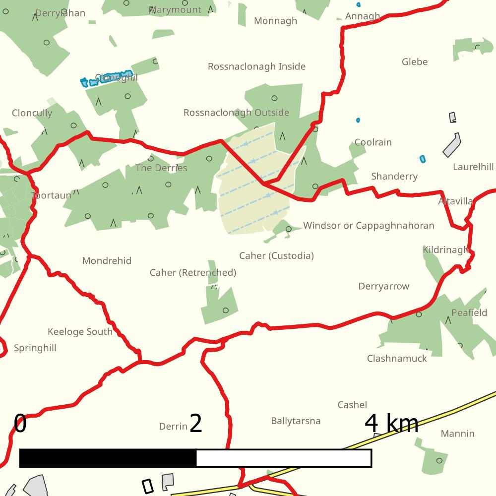

---
title:
author: 
date:
output: 
  html_document:
    fig_height: 5
    highlight: haddock
    self_contained: yes
    theme: cerulean
    toc: yes
    toc_depth: 1
    toc_float: TRUE
    number_sections: TRUE
    params: 
  
---

---
title: "Electoral Division Health Profile for Caher, Laois"
---


<br>


<div class="figure" style="text-align: center">

<p class="caption">Figure 1. Boundary Map for Caher, Laois Electoral Division (Sources: OSI, Ireland; OpenStreetMap). Map style by Champs-Libres Coop., distributed under CC BY-SA.</p>
</div>
<br>

<div align="center">


 <font size="5"> Census 2022</font>

 <font size="4"> CSO, Ireland  (http://www.cso.ie)</font>
 
<font size="5"><a href="https://cdn.jsdelivr.net/gh/CSOIreland/edprofiles@resources/2022/health/pdf/31-caher-laois-ac-laois-county-council.pdf" style="text-decoration: none">A more detailed and print friendly pdf profile - with accompanying tables - is available here.</a></font>


*Note: This is the first time this profile has been compiled. While effort has been made to ensure this document is error free, it is possible that there may be some. Please email tomas.kelly@cso.ie if you observe any errors or inconsistencies with other CSO data.*


</div>
# Key Points

* Caher, Laois covers a total **area** of  **8.3** square kilometers and has a **population density** of **13** persons per square kilometer. The population density of Ireland as a whole is  73.3. 

* The **Age Dependency Ratio of this Electoral Division (ED) is  ** **66.2**. This compares to 53.2 nationally. The Age Dependency Ratio is the amount of people outside of working age (0-14 and 65+) per 100 people of working age (15-64). 

* Caher, Laois has a total of **108 persons** and  **29 families** living in private households.

* There are a total of **22 persons aged 0-14** in this ED and **21 persons aged over 65**.

* There are a total of **27 persons living with a disability** in this ED, representing **25.0 percent** of the population. This compares with , 21.5, percent nationally 

* **3 people** in this ED have **bad or very bad general health**. This represents **2.8 percent** of the population. 1.7 percent of the population have bad or very bad general health nationally. 

* There are a total of **14 carers** in this ED, representing **13 percent** of the population. This compares with 5.8 percent of the population that are carers nationally. 

* **9.3 percent** of this ED **smoke tobacco products**. 13.1 percent of people nationally smoke tobacco products

* There are **0 short term unemployed** and **1 long term unemployed** people in this ED. These represent **0.0** and **1.2** percent of the population respectively.

* **5.6 percent** of the population of Caher, Laois are **unskilled**. 3.1 percent of people in the state are unskilled.

* **30.1 percent** of those aged 15+ in this ED have a **highest level of education of lower secondary or lower**. This compares with 23 percent nationally. 

* **27.3 percent** of families with children in this ED have **lone parents**. This stands at 24.8 nationally.

* **9.2 percent** of this ED were **born outside Ireland** (20 percent nationally).

* **Households rented from a Local Authority** comprise **2.9 percent** of households in this ED.This stands at 8.3 percent nationally


# Population

<div class="figure">

```{=html}
<div class="highchart html-widget html-fill-item" id="htmlwidget-21feb864be17abd4738c" style="width:650px;height:480px;"></div>
<script type="application/json" data-for="htmlwidget-21feb864be17abd4738c">{"x":{"hc_opts":{"chart":{"reflow":true},"title":{"text":"Males","align":"center","x":-115,"y":20,"margin":0,"style":{"fontSize":"12px","color":"#FF0000"}},"yAxis":{"title":{"text":null},"min":-8,"max":8,"labels":{"formatter":"function() {\n        return Math.abs(this.value); /* all labels to absolute values */\n    }"}},"credits":{"enabled":false},"exporting":{"enabled":false},"boost":{"enabled":false},"plotOptions":{"series":{"label":{"enabled":false},"turboThreshold":0},"treemap":{"layoutAlgorithm":"squarified"},"bar":{"stacking":"normal"}},"series":[{"name":"Female","data":[{"Sex":"Females","Age":"Age 0-4","CSO.Electoral.Divisions.2022":"Caher, Laois","Census.Year":"2022","Statistic":"Population","value":1,"Percentage":1.9,"Gender":"Female","y":1,"name":"Age 0-4"},{"Sex":"Females","Age":"Age 5-9","CSO.Electoral.Divisions.2022":"Caher, Laois","Census.Year":"2022","Statistic":"Population","value":3,"Percentage":5.8,"Gender":"Female","y":3,"name":"Age 5-9"},{"Sex":"Females","Age":"Age 10-14","CSO.Electoral.Divisions.2022":"Caher, Laois","Census.Year":"2022","Statistic":"Population","value":7,"Percentage":13.5,"Gender":"Female","y":7,"name":"Age 10-14"},{"Sex":"Females","Age":"Age 15-19","CSO.Electoral.Divisions.2022":"Caher, Laois","Census.Year":"2022","Statistic":"Population","value":5,"Percentage":9.6,"Gender":"Female","y":5,"name":"Age 15-19"},{"Sex":"Females","Age":"Age 20-24","CSO.Electoral.Divisions.2022":"Caher, Laois","Census.Year":"2022","Statistic":"Population","value":4,"Percentage":7.7,"Gender":"Female","y":4,"name":"Age 20-24"},{"Sex":"Females","Age":"Age 25-29","CSO.Electoral.Divisions.2022":"Caher, Laois","Census.Year":"2022","Statistic":"Population","value":1,"Percentage":1.9,"Gender":"Female","y":1,"name":"Age 25-29"},{"Sex":"Females","Age":"Age 30-34","CSO.Electoral.Divisions.2022":"Caher, Laois","Census.Year":"2022","Statistic":"Population","value":2,"Percentage":3.8,"Gender":"Female","y":2,"name":"Age 30-34"},{"Sex":"Females","Age":"Age 35-39","CSO.Electoral.Divisions.2022":"Caher, Laois","Census.Year":"2022","Statistic":"Population","value":1,"Percentage":1.9,"Gender":"Female","y":1,"name":"Age 35-39"},{"Sex":"Females","Age":"Age 40-44","CSO.Electoral.Divisions.2022":"Caher, Laois","Census.Year":"2022","Statistic":"Population","value":4,"Percentage":7.7,"Gender":"Female","y":4,"name":"Age 40-44"},{"Sex":"Females","Age":"Age 45-49","CSO.Electoral.Divisions.2022":"Caher, Laois","Census.Year":"2022","Statistic":"Population","value":5,"Percentage":9.6,"Gender":"Female","y":5,"name":"Age 45-49"},{"Sex":"Females","Age":"Age 50-54","CSO.Electoral.Divisions.2022":"Caher, Laois","Census.Year":"2022","Statistic":"Population","value":5,"Percentage":9.6,"Gender":"Female","y":5,"name":"Age 50-54"},{"Sex":"Females","Age":"Age 55-59","CSO.Electoral.Divisions.2022":"Caher, Laois","Census.Year":"2022","Statistic":"Population","value":1,"Percentage":1.9,"Gender":"Female","y":1,"name":"Age 55-59"},{"Sex":"Females","Age":"Age 60-64","CSO.Electoral.Divisions.2022":"Caher, Laois","Census.Year":"2022","Statistic":"Population","value":4,"Percentage":7.7,"Gender":"Female","y":4,"name":"Age 60-64"},{"Sex":"Females","Age":"Age 65-69","CSO.Electoral.Divisions.2022":"Caher, Laois","Census.Year":"2022","Statistic":"Population","value":4,"Percentage":7.7,"Gender":"Female","y":4,"name":"Age 65-69"},{"Sex":"Females","Age":"Age 70-74","CSO.Electoral.Divisions.2022":"Caher, Laois","Census.Year":"2022","Statistic":"Population","value":0,"Percentage":0,"Gender":"Female","y":0,"name":"Age 70-74"},{"Sex":"Females","Age":"Age 75-79","CSO.Electoral.Divisions.2022":"Caher, Laois","Census.Year":"2022","Statistic":"Population","value":2,"Percentage":3.8,"Gender":"Female","y":2,"name":"Age 75-79"},{"Sex":"Females","Age":"Age 80-84","CSO.Electoral.Divisions.2022":"Caher, Laois","Census.Year":"2022","Statistic":"Population","value":1,"Percentage":1.9,"Gender":"Female","y":1,"name":"Age 80-84"},{"Sex":"Females","Age":"Age 85 and over","CSO.Electoral.Divisions.2022":"Caher, Laois","Census.Year":"2022","Statistic":"Population","value":2,"Percentage":3.8,"Gender":"Female","y":2,"name":"Age 85 and over"}],"type":"bar","color":"#2f7ed8","showInLegend":false},{"name":"Male","data":[{"Sex":"Males","Age":"Age 0-4","CSO.Electoral.Divisions.2022":"Caher, Laois","Census.Year":"2022","Statistic":"Population","value":-2,"Percentage":3.6,"Gender":"Male","y":-2,"name":"Age 0-4"},{"Sex":"Males","Age":"Age 5-9","CSO.Electoral.Divisions.2022":"Caher, Laois","Census.Year":"2022","Statistic":"Population","value":-4,"Percentage":7.1,"Gender":"Male","y":-4,"name":"Age 5-9"},{"Sex":"Males","Age":"Age 10-14","CSO.Electoral.Divisions.2022":"Caher, Laois","Census.Year":"2022","Statistic":"Population","value":-5,"Percentage":8.9,"Gender":"Male","y":-5,"name":"Age 10-14"},{"Sex":"Males","Age":"Age 15-19","CSO.Electoral.Divisions.2022":"Caher, Laois","Census.Year":"2022","Statistic":"Population","value":-2,"Percentage":3.6,"Gender":"Male","y":-2,"name":"Age 15-19"},{"Sex":"Males","Age":"Age 20-24","CSO.Electoral.Divisions.2022":"Caher, Laois","Census.Year":"2022","Statistic":"Population","value":-6,"Percentage":10.7,"Gender":"Male","y":-6,"name":"Age 20-24"},{"Sex":"Males","Age":"Age 25-29","CSO.Electoral.Divisions.2022":"Caher, Laois","Census.Year":"2022","Statistic":"Population","value":-1,"Percentage":1.8,"Gender":"Male","y":-1,"name":"Age 25-29"},{"Sex":"Males","Age":"Age 30-34","CSO.Electoral.Divisions.2022":"Caher, Laois","Census.Year":"2022","Statistic":"Population","value":-2,"Percentage":3.6,"Gender":"Male","y":-2,"name":"Age 30-34"},{"Sex":"Males","Age":"Age 35-39","CSO.Electoral.Divisions.2022":"Caher, Laois","Census.Year":"2022","Statistic":"Population","value":-0,"Percentage":0,"Gender":"Male","y":-0,"name":"Age 35-39"},{"Sex":"Males","Age":"Age 40-44","CSO.Electoral.Divisions.2022":"Caher, Laois","Census.Year":"2022","Statistic":"Population","value":-6,"Percentage":10.7,"Gender":"Male","y":-6,"name":"Age 40-44"},{"Sex":"Males","Age":"Age 45-49","CSO.Electoral.Divisions.2022":"Caher, Laois","Census.Year":"2022","Statistic":"Population","value":-6,"Percentage":10.7,"Gender":"Male","y":-6,"name":"Age 45-49"},{"Sex":"Males","Age":"Age 50-54","CSO.Electoral.Divisions.2022":"Caher, Laois","Census.Year":"2022","Statistic":"Population","value":-6,"Percentage":10.7,"Gender":"Male","y":-6,"name":"Age 50-54"},{"Sex":"Males","Age":"Age 55-59","CSO.Electoral.Divisions.2022":"Caher, Laois","Census.Year":"2022","Statistic":"Population","value":-2,"Percentage":3.6,"Gender":"Male","y":-2,"name":"Age 55-59"},{"Sex":"Males","Age":"Age 60-64","CSO.Electoral.Divisions.2022":"Caher, Laois","Census.Year":"2022","Statistic":"Population","value":-2,"Percentage":3.6,"Gender":"Male","y":-2,"name":"Age 60-64"},{"Sex":"Males","Age":"Age 65-69","CSO.Electoral.Divisions.2022":"Caher, Laois","Census.Year":"2022","Statistic":"Population","value":-7,"Percentage":12.5,"Gender":"Male","y":-7,"name":"Age 65-69"},{"Sex":"Males","Age":"Age 70-74","CSO.Electoral.Divisions.2022":"Caher, Laois","Census.Year":"2022","Statistic":"Population","value":-3,"Percentage":5.4,"Gender":"Male","y":-3,"name":"Age 70-74"},{"Sex":"Males","Age":"Age 75-79","CSO.Electoral.Divisions.2022":"Caher, Laois","Census.Year":"2022","Statistic":"Population","value":-0,"Percentage":0,"Gender":"Male","y":-0,"name":"Age 75-79"},{"Sex":"Males","Age":"Age 80-84","CSO.Electoral.Divisions.2022":"Caher, Laois","Census.Year":"2022","Statistic":"Population","value":-0,"Percentage":0,"Gender":"Male","y":-0,"name":"Age 80-84"},{"Sex":"Males","Age":"Age 85 and over","CSO.Electoral.Divisions.2022":"Caher, Laois","Census.Year":"2022","Statistic":"Population","value":-2,"Percentage":3.6,"Gender":"Male","y":-2,"name":"Age 85 and over"}],"type":"bar","color":"#FF0000","showInLegend":false}],"xAxis":{"categories":["Age 0-4","Age 5-9","Age 10-14","Age 15-19","Age 20-24","Age 25-29","Age 30-34","Age 35-39","Age 40-44","Age 45-49","Age 50-54","Age 55-59","Age 60-64","Age 65-69","Age 70-74","Age 75-79","Age 80-84","Age 85 and over"],"reversed":false},"subtitle":{"text":"Females","align":"center","y":20,"margin":0,"x":250,"style":{"fontSize":"12px","color":"#2f7ed8"}},"tooltip":{"formatter":"function() { return Math.abs(this.point.y); }"}},"theme":{"chart":{"backgroundColor":"transparent"},"colors":["#7cb5ec","#434348","#90ed7d","#f7a35c","#8085e9","#f15c80","#e4d354","#2b908f","#f45b5b","#91e8e1"]},"conf_opts":{"global":{"Date":null,"VMLRadialGradientURL":"http =//code.highcharts.com/list(version)/gfx/vml-radial-gradient.png","canvasToolsURL":"http =//code.highcharts.com/list(version)/modules/canvas-tools.js","getTimezoneOffset":null,"timezoneOffset":0,"useUTC":true},"lang":{"contextButtonTitle":"Chart context menu","decimalPoint":".","downloadCSV":"Download CSV","downloadJPEG":"Download JPEG image","downloadPDF":"Download PDF document","downloadPNG":"Download PNG image","downloadSVG":"Download SVG vector image","downloadXLS":"Download XLS","drillUpText":"◁ Back to {series.name}","exitFullscreen":"Exit from full screen","exportData":{"annotationHeader":"Annotations","categoryDatetimeHeader":"DateTime","categoryHeader":"Category"},"hideData":"Hide data table","invalidDate":null,"loading":"Loading...","months":["January","February","March","April","May","June","July","August","September","October","November","December"],"noData":"No data to display","numericSymbolMagnitude":1000,"numericSymbols":["k","M","G","T","P","E"],"printChart":"Print chart","resetZoom":"Reset zoom","resetZoomTitle":"Reset zoom level 1:1","shortMonths":["Jan","Feb","Mar","Apr","May","Jun","Jul","Aug","Sep","Oct","Nov","Dec"],"shortWeekdays":["Sat","Sun","Mon","Tue","Wed","Thu","Fri"],"thousandsSep":" ","viewData":"View data table","viewFullscreen":"View in full screen","weekdays":["Sunday","Monday","Tuesday","Wednesday","Thursday","Friday","Saturday"]}},"type":"chart","fonts":[],"debug":false},"evals":["hc_opts.yAxis.labels.formatter","hc_opts.tooltip.formatter"],"jsHooks":[]}</script>
```

<p class="caption">Figure 2. Persons by Age Group and Gender for Caher, Laois; Administrative County and State; Census 2022.</p>
</div>

# Disability

<div class="figure">

```{=html}
<div class="highchart html-widget html-fill-item" id="htmlwidget-f0929551b49c243d9d4e" style="width:650px;height:480px;"></div>
<script type="application/json" data-for="htmlwidget-f0929551b49c243d9d4e">{"x":{"hc_opts":{"chart":{"reflow":true},"title":{"text":null},"yAxis":{"title":{"text":"% of Population"}},"credits":{"enabled":false},"exporting":{"enabled":false},"boost":{"enabled":false},"plotOptions":{"series":{"label":{"enabled":false},"turboThreshold":0},"treemap":{"layoutAlgorithm":"squarified"}},"series":[{"name":"Caher, Laois","data":[{"Electoral.Divisions":"Caher, Laois","Age.Group":"All ages","Sex":"Both sexes","CensusYear":"2022","Population with any disability":27,"Population with a disability to a great extent":10,"Population with a disability to some extent":17,"Population with a disability as a percentage":25,"Population with a disability to a great extent as a percentage":9.300000000000001,"Population with a disability to some extent as a percentage":15.7,"TotalPop":null,"colouract":"#405381","y":25,"color":"#405381","name":"All ages"},{"Electoral.Divisions":"Caher, Laois","Age.Group":"0 - 14 years","Sex":"Both sexes","CensusYear":"2022","Population with any disability":3,"Population with a disability to a great extent":2,"Population with a disability to some extent":1,"Population with a disability as a percentage":13.6,"Population with a disability to a great extent as a percentage":9.1,"Population with a disability to some extent as a percentage":4.5,"TotalPop":null,"colouract":"#405381","y":13.6,"color":"#405381","name":"0 - 14 years"},{"Electoral.Divisions":"Caher, Laois","Age.Group":"15 -24 years","Sex":"Both sexes","CensusYear":"2022","Population with any disability":4,"Population with a disability to a great extent":1,"Population with a disability to some extent":3,"Population with a disability as a percentage":23.5,"Population with a disability to a great extent as a percentage":5.9,"Population with a disability to some extent as a percentage":17.6,"TotalPop":null,"colouract":"#405381","y":23.5,"color":"#405381","name":"15 -24 years"},{"Electoral.Divisions":"Caher, Laois","Age.Group":"25 - 44 years","Sex":"Both sexes","CensusYear":"2022","Population with any disability":4,"Population with a disability to a great extent":1,"Population with a disability to some extent":3,"Population with a disability as a percentage":23.5,"Population with a disability to a great extent as a percentage":5.9,"Population with a disability to some extent as a percentage":17.6,"TotalPop":null,"colouract":"#405381","y":23.5,"color":"#405381","name":"25 - 44 years"},{"Electoral.Divisions":"Caher, Laois","Age.Group":"45 - 64 years","Sex":"Both sexes","CensusYear":"2022","Population with any disability":3,"Population with a disability to a great extent":0,"Population with a disability to some extent":3,"Population with a disability as a percentage":9.699999999999999,"Population with a disability to a great extent as a percentage":0,"Population with a disability to some extent as a percentage":9.699999999999999,"TotalPop":null,"colouract":"#405381","y":9.699999999999999,"color":"#405381","name":"45 - 64 years"},{"Electoral.Divisions":"Caher, Laois","Age.Group":"65 years and over","Sex":"Both sexes","CensusYear":"2022","Population with any disability":13,"Population with a disability to a great extent":6,"Population with a disability to some extent":7,"Population with a disability as a percentage":61.9,"Population with a disability to a great extent as a percentage":28.6,"Population with a disability to some extent as a percentage":33.3,"TotalPop":null,"colouract":"#405381","y":61.9,"color":"#405381","name":"65 years and over"}],"type":"column","color":"#405381","showInLegend":true},{"name":"Laois County Council","data":[{"Electoral.Divisions":"Laois County Council","Age.Group":"0 - 14 years","Sex":"Both sexes","CensusYear":"2022","Population with any disability":2302,"Population with a disability to a great extent":917,"Population with a disability to some extent":1385,"Population with a disability as a percentage":11.3,"Population with a disability to a great extent as a percentage":13.0442585078,"Population with a disability to some extent as a percentage":19.2750183556,"TotalPop":20408,"colouract":"#FCBE72","y":11.3,"color":"#FCBE72","name":"0 - 14 years"},{"Electoral.Divisions":"Laois County Council","Age.Group":"15 -24 years","Sex":"Both sexes","CensusYear":"2022","Population with any disability":2110,"Population with a disability to a great extent":720,"Population with a disability to some extent":1390,"Population with a disability as a percentage":18.2,"Population with a disability to a great extent as a percentage":12.4629723926,"Population with a disability to some extent as a percentage":24.167383666,"TotalPop":11569,"colouract":"#FCBE72","y":18.2,"color":"#FCBE72","name":"15 -24 years"},{"Electoral.Divisions":"Laois County Council","Age.Group":"25 - 44 years","Sex":"Both sexes","CensusYear":"2022","Population with any disability":4338,"Population with a disability to a great extent":1424,"Population with a disability to some extent":2914,"Population with a disability as a percentage":17.4,"Population with a disability to a great extent as a percentage":23.0444272664,"Population with a disability to some extent as a percentage":46.962440947,"TotalPop":24878,"colouract":"#FCBE72","y":17.4,"color":"#FCBE72","name":"25 - 44 years"},{"Electoral.Divisions":"Laois County Council","Age.Group":"45 - 64 years","Sex":"Both sexes","CensusYear":"2022","Population with any disability":5929,"Population with a disability to a great extent":2251,"Population with a disability to some extent":3678,"Population with a disability as a percentage":25.7,"Population with a disability to a great extent as a percentage":40.431105924,"Population with a disability to some extent as a percentage":64.68875620999999,"TotalPop":23044,"colouract":"#FCBE72","y":25.7,"color":"#FCBE72","name":"45 - 64 years"},{"Electoral.Divisions":"Laois County Council","Age.Group":"65 years and over","Sex":"Both sexes","CensusYear":"2022","Population with any disability":5427,"Population with a disability to a great extent":2367,"Population with a disability to some extent":3060,"Population with a disability as a percentage":45.3,"Population with a disability to a great extent as a percentage":123.409077335,"Population with a disability to some extent as a percentage":136.448842516,"TotalPop":11978,"colouract":"#FCBE72","y":45.3,"color":"#FCBE72","name":"65 years and over"},{"Electoral.Divisions":"Laois County Council","Age.Group":"All ages","Sex":"Both sexes","CensusYear":"2022","Population with any disability":20106,"Population with a disability to a great extent":7679,"Population with a disability to some extent":12427,"Population with a disability as a percentage":21.9,"Population with a disability to a great extent as a percentage":8.3579132971,"Population with a disability to some extent as a percentage":13.525691958,"TotalPop":91877,"colouract":"#FCBE72","y":21.9,"color":"#FCBE72","name":"All ages"}],"type":"column","color":"#FCBE72","showInLegend":true},{"name":"State","data":[{"Electoral.Divisions":"State","Age.Group":"All ages","Sex":"Both sexes","CensusYear":"2022","Population with any disability":1109557,"Population with a disability to a great extent":407342,"Population with a disability to some extent":702215,"Population with a disability as a percentage":21.5,"Population with a disability to a great extent as a percentage":7.9,"Population with a disability to some extent as a percentage":13.6,"TotalPop":null,"colouract":"#13C1A5","y":21.5,"color":"#13C1A5","name":"All ages"},{"Electoral.Divisions":"State","Age.Group":"0 - 14 years","Sex":"Both sexes","CensusYear":"2022","Population with any disability":98799,"Population with a disability to a great extent":35846,"Population with a disability to some extent":62953,"Population with a disability as a percentage":9.800000000000001,"Population with a disability to a great extent as a percentage":3.5,"Population with a disability to some extent as a percentage":6.2,"TotalPop":null,"colouract":"#13C1A5","y":9.800000000000001,"color":"#13C1A5","name":"0 - 14 years"},{"Electoral.Divisions":"State","Age.Group":"15 -24 years","Sex":"Both sexes","CensusYear":"2022","Population with any disability":117146,"Population with a disability to a great extent":36602,"Population with a disability to some extent":80544,"Population with a disability as a percentage":18.2,"Population with a disability to a great extent as a percentage":5.7,"Population with a disability to some extent as a percentage":12.5,"TotalPop":null,"colouract":"#13C1A5","y":18.2,"color":"#13C1A5","name":"15 -24 years"},{"Electoral.Divisions":"State","Age.Group":"25 - 44 years","Sex":"Both sexes","CensusYear":"2022","Population with any disability":235342,"Population with a disability to a great extent":69115,"Population with a disability to some extent":166227,"Population with a disability as a percentage":16.5,"Population with a disability to a great extent as a percentage":4.9,"Population with a disability to some extent as a percentage":11.7,"TotalPop":null,"colouract":"#13C1A5","y":16.5,"color":"#13C1A5","name":"25 - 44 years"},{"Electoral.Divisions":"State","Age.Group":"45 - 64 years","Sex":"Both sexes","CensusYear":"2022","Population with any disability":308595,"Population with a disability to a great extent":114572,"Population with a disability to some extent":194023,"Population with a disability as a percentage":23.9,"Population with a disability to a great extent as a percentage":8.9,"Population with a disability to some extent as a percentage":15,"TotalPop":null,"colouract":"#13C1A5","y":23.9,"color":"#13C1A5","name":"45 - 64 years"},{"Electoral.Divisions":"State","Age.Group":"65 years and over","Sex":"Both sexes","CensusYear":"2022","Population with any disability":349675,"Population with a disability to a great extent":151207,"Population with a disability to some extent":198468,"Population with a disability as a percentage":45,"Population with a disability to a great extent as a percentage":19.5,"Population with a disability to some extent as a percentage":25.6,"TotalPop":null,"colouract":"#13C1A5","y":45,"color":"#13C1A5","name":"65 years and over"}],"type":"column","color":"#13C1A5","showInLegend":true}],"xAxis":{"type":"category","title":{"text":"Age Group"}}},"theme":{"chart":{"backgroundColor":"transparent"},"colors":["#7cb5ec","#434348","#90ed7d","#f7a35c","#8085e9","#f15c80","#e4d354","#2b908f","#f45b5b","#91e8e1"]},"conf_opts":{"global":{"Date":null,"VMLRadialGradientURL":"http =//code.highcharts.com/list(version)/gfx/vml-radial-gradient.png","canvasToolsURL":"http =//code.highcharts.com/list(version)/modules/canvas-tools.js","getTimezoneOffset":null,"timezoneOffset":0,"useUTC":true},"lang":{"contextButtonTitle":"Chart context menu","decimalPoint":".","downloadCSV":"Download CSV","downloadJPEG":"Download JPEG image","downloadPDF":"Download PDF document","downloadPNG":"Download PNG image","downloadSVG":"Download SVG vector image","downloadXLS":"Download XLS","drillUpText":"◁ Back to {series.name}","exitFullscreen":"Exit from full screen","exportData":{"annotationHeader":"Annotations","categoryDatetimeHeader":"DateTime","categoryHeader":"Category"},"hideData":"Hide data table","invalidDate":null,"loading":"Loading...","months":["January","February","March","April","May","June","July","August","September","October","November","December"],"noData":"No data to display","numericSymbolMagnitude":1000,"numericSymbols":["k","M","G","T","P","E"],"printChart":"Print chart","resetZoom":"Reset zoom","resetZoomTitle":"Reset zoom level 1:1","shortMonths":["Jan","Feb","Mar","Apr","May","Jun","Jul","Aug","Sep","Oct","Nov","Dec"],"shortWeekdays":["Sat","Sun","Mon","Tue","Wed","Thu","Fri"],"thousandsSep":" ","viewData":"View data table","viewFullscreen":"View in full screen","weekdays":["Sunday","Monday","Tuesday","Wednesday","Thursday","Friday","Saturday"]}},"type":"chart","fonts":[],"debug":false},"evals":[],"jsHooks":[]}</script>
```

<p class="caption">Figure 3. Percentage of Population with any Disability by Age Group for Caher, Laois; Administrative County and State; Census 2022.</p>
</div>


# General Health

<div class="figure">

```{=html}
<div class="highchart html-widget html-fill-item" id="htmlwidget-bbea1c1a9aaee9958f79" style="width:650px;height:480px;"></div>
<script type="application/json" data-for="htmlwidget-bbea1c1a9aaee9958f79">{"x":{"hc_opts":{"chart":{"reflow":true},"title":{"text":null},"yAxis":{"title":{"text":"% of Population"}},"credits":{"enabled":false},"exporting":{"enabled":false},"boost":{"enabled":false},"plotOptions":{"series":{"label":{"enabled":false},"turboThreshold":0},"treemap":{"layoutAlgorithm":"squarified"}},"series":[{"name":"Caher, Laois","data":[{"CSO.Electoral.Divisions.2022":"Caher, Laois","General.Health":"Very Good","Sex":"Both Sexes","Census.Year":"2022","Statistic":"General Health of Population","value":60,"Percentage.Of.Population":55.6,"colouract":"#405381","y":55.6,"color":"#405381","name":"Very Good"},{"CSO.Electoral.Divisions.2022":"Caher, Laois","General.Health":"Good","Sex":"Both Sexes","Census.Year":"2022","Statistic":"General Health of Population","value":33,"Percentage.Of.Population":30.6,"colouract":"#405381","y":30.6,"color":"#405381","name":"Good"},{"CSO.Electoral.Divisions.2022":"Caher, Laois","General.Health":"Fair","Sex":"Both Sexes","Census.Year":"2022","Statistic":"General Health of Population","value":11,"Percentage.Of.Population":10.2,"colouract":"#405381","y":10.2,"color":"#405381","name":"Fair"},{"CSO.Electoral.Divisions.2022":"Caher, Laois","General.Health":"Bad","Sex":"Both Sexes","Census.Year":"2022","Statistic":"General Health of Population","value":2,"Percentage.Of.Population":1.9,"colouract":"#405381","y":1.9,"color":"#405381","name":"Bad"},{"CSO.Electoral.Divisions.2022":"Caher, Laois","General.Health":"Very Bad","Sex":"Both Sexes","Census.Year":"2022","Statistic":"General Health of Population","value":1,"Percentage.Of.Population":0.9,"colouract":"#405381","y":0.9,"color":"#405381","name":"Very Bad"},{"CSO.Electoral.Divisions.2022":"Caher, Laois","General.Health":"Not Stated","Sex":"Both Sexes","Census.Year":"2022","Statistic":"General Health of Population","value":1,"Percentage.Of.Population":0.9,"colouract":"#405381","y":0.9,"color":"#405381","name":"Not Stated"}],"type":"column","color":"#405381","showInLegend":true},{"name":"Laois County Council","data":[{"CSO.Electoral.Divisions.2022":"Laois County Council","General.Health":"Very Good","Sex":"Both Sexes","Census.Year":"2022","Statistic":"General Health of Population","value":49013,"Percentage.Of.Population":53.3,"colouract":"#FCBE72","y":53.3,"color":"#FCBE72","name":"Very Good"},{"CSO.Electoral.Divisions.2022":"Laois County Council","General.Health":"Good","Sex":"Both Sexes","Census.Year":"2022","Statistic":"General Health of Population","value":27955,"Percentage.Of.Population":30.4,"colouract":"#FCBE72","y":30.4,"color":"#FCBE72","name":"Good"},{"CSO.Electoral.Divisions.2022":"Laois County Council","General.Health":"Fair","Sex":"Both Sexes","Census.Year":"2022","Statistic":"General Health of Population","value":8103,"Percentage.Of.Population":8.800000000000001,"colouract":"#FCBE72","y":8.800000000000001,"color":"#FCBE72","name":"Fair"},{"CSO.Electoral.Divisions.2022":"Laois County Council","General.Health":"Bad","Sex":"Both Sexes","Census.Year":"2022","Statistic":"General Health of Population","value":1376,"Percentage.Of.Population":1.5,"colouract":"#FCBE72","y":1.5,"color":"#FCBE72","name":"Bad"},{"CSO.Electoral.Divisions.2022":"Laois County Council","General.Health":"Very Bad","Sex":"Both Sexes","Census.Year":"2022","Statistic":"General Health of Population","value":290,"Percentage.Of.Population":0.3,"colouract":"#FCBE72","y":0.3,"color":"#FCBE72","name":"Very Bad"},{"CSO.Electoral.Divisions.2022":"Laois County Council","General.Health":"Not Stated","Sex":"Both Sexes","Census.Year":"2022","Statistic":"General Health of Population","value":5140,"Percentage.Of.Population":5.6,"colouract":"#FCBE72","y":5.6,"color":"#FCBE72","name":"Not Stated"}],"type":"column","color":"#FCBE72","showInLegend":true},{"name":"State","data":[{"CSO.Electoral.Divisions.2022":"State","General.Health":"Very Good","Sex":"Both Sexes","Census.Year":"2022","Statistic":"General Health of Population","value":2740994,"Percentage.Of.Population":53.2,"colouract":"#13C1A5","y":53.2,"color":"#13C1A5","name":"Very Good"},{"CSO.Electoral.Divisions.2022":"State","General.Health":"Good","Sex":"Both Sexes","Census.Year":"2022","Statistic":"General Health of Population","value":1527027,"Percentage.Of.Population":29.7,"colouract":"#13C1A5","y":29.7,"color":"#13C1A5","name":"Good"},{"CSO.Electoral.Divisions.2022":"State","General.Health":"Fair","Sex":"Both Sexes","Census.Year":"2022","Statistic":"General Health of Population","value":444895,"Percentage.Of.Population":8.6,"colouract":"#13C1A5","y":8.6,"color":"#13C1A5","name":"Fair"},{"CSO.Electoral.Divisions.2022":"State","General.Health":"Bad","Sex":"Both Sexes","Census.Year":"2022","Statistic":"General Health of Population","value":72556,"Percentage.Of.Population":1.4,"colouract":"#13C1A5","y":1.4,"color":"#13C1A5","name":"Bad"},{"CSO.Electoral.Divisions.2022":"State","General.Health":"Very Bad","Sex":"Both Sexes","Census.Year":"2022","Statistic":"General Health of Population","value":16843,"Percentage.Of.Population":0.3,"colouract":"#13C1A5","y":0.3,"color":"#13C1A5","name":"Very Bad"},{"CSO.Electoral.Divisions.2022":"State","General.Health":"Not Stated","Sex":"Both Sexes","Census.Year":"2022","Statistic":"General Health of Population","value":346824,"Percentage.Of.Population":6.7,"colouract":"#13C1A5","y":6.7,"color":"#13C1A5","name":"Not Stated"}],"type":"column","color":"#13C1A5","showInLegend":true}],"xAxis":{"type":"category","title":{"text":"General Health"}}},"theme":{"chart":{"backgroundColor":"transparent"},"colors":["#7cb5ec","#434348","#90ed7d","#f7a35c","#8085e9","#f15c80","#e4d354","#2b908f","#f45b5b","#91e8e1"]},"conf_opts":{"global":{"Date":null,"VMLRadialGradientURL":"http =//code.highcharts.com/list(version)/gfx/vml-radial-gradient.png","canvasToolsURL":"http =//code.highcharts.com/list(version)/modules/canvas-tools.js","getTimezoneOffset":null,"timezoneOffset":0,"useUTC":true},"lang":{"contextButtonTitle":"Chart context menu","decimalPoint":".","downloadCSV":"Download CSV","downloadJPEG":"Download JPEG image","downloadPDF":"Download PDF document","downloadPNG":"Download PNG image","downloadSVG":"Download SVG vector image","downloadXLS":"Download XLS","drillUpText":"◁ Back to {series.name}","exitFullscreen":"Exit from full screen","exportData":{"annotationHeader":"Annotations","categoryDatetimeHeader":"DateTime","categoryHeader":"Category"},"hideData":"Hide data table","invalidDate":null,"loading":"Loading...","months":["January","February","March","April","May","June","July","August","September","October","November","December"],"noData":"No data to display","numericSymbolMagnitude":1000,"numericSymbols":["k","M","G","T","P","E"],"printChart":"Print chart","resetZoom":"Reset zoom","resetZoomTitle":"Reset zoom level 1:1","shortMonths":["Jan","Feb","Mar","Apr","May","Jun","Jul","Aug","Sep","Oct","Nov","Dec"],"shortWeekdays":["Sat","Sun","Mon","Tue","Wed","Thu","Fri"],"thousandsSep":" ","viewData":"View data table","viewFullscreen":"View in full screen","weekdays":["Sunday","Monday","Tuesday","Wednesday","Thursday","Friday","Saturday"]}},"type":"chart","fonts":[],"debug":false},"evals":[],"jsHooks":[]}</script>
```

<p class="caption">Figure 4. Population Breakdown (%) by General Health for  Caher, Laois; Administrative County and State;  Census 2022.</p>
</div>


# Carers

<div class="figure">

```{=html}
<div class="highchart html-widget html-fill-item" id="htmlwidget-234f7a74712003ebd0e9" style="width:650px;height:480px;"></div>
<script type="application/json" data-for="htmlwidget-234f7a74712003ebd0e9">{"x":{"hc_opts":{"chart":{"reflow":true},"title":{"text":null},"yAxis":{"title":{"text":"% of Population"}},"credits":{"enabled":false},"exporting":{"enabled":false},"boost":{"enabled":false},"plotOptions":{"series":{"label":{"enabled":false},"turboThreshold":0},"treemap":{"layoutAlgorithm":"squarified"}},"series":[{"name":"Caher, Laois","data":[{"CSO.Electoral.Divisions.2022":"Caher, Laois","Sex":"Males","Census.Year":"2022","Statistic":"Carers","value":6,"TotalPop":56,"PercentageOfPopulation":10.7,"colouract":"#405381","y":10.7,"color":"#405381","name":"Males"},{"CSO.Electoral.Divisions.2022":"Caher, Laois","Sex":"Females","Census.Year":"2022","Statistic":"Carers","value":8,"TotalPop":52,"PercentageOfPopulation":15.4,"colouract":"#405381","y":15.4,"color":"#405381","name":"Females"},{"CSO.Electoral.Divisions.2022":"Caher, Laois","Sex":"Both Sexes","Census.Year":"2022","Statistic":"Carers","value":14,"TotalPop":108,"PercentageOfPopulation":13,"colouract":"#405381","y":13,"color":"#405381","name":"Both Sexes"}],"type":"column","color":"#405381","showInLegend":true},{"name":"Laois County Council","data":[{"CSO.Electoral.Divisions.2022":"Laois County Council","Sex":"Males","Census.Year":"2022","Statistic":"Carers","value":2116,"TotalPop":46278,"PercentageOfPopulation":4.6,"colouract":"#FCBE72","y":4.6,"color":"#FCBE72","name":"Males"},{"CSO.Electoral.Divisions.2022":"Laois County Council","Sex":"Females","Census.Year":"2022","Statistic":"Carers","value":3389,"TotalPop":45599,"PercentageOfPopulation":7.4,"colouract":"#FCBE72","y":7.4,"color":"#FCBE72","name":"Females"},{"CSO.Electoral.Divisions.2022":"Laois County Council","Sex":"Both Sexes","Census.Year":"2022","Statistic":"Carers","value":5505,"TotalPop":91877,"PercentageOfPopulation":6,"colouract":"#FCBE72","y":6,"color":"#FCBE72","name":"Both Sexes"}],"type":"column","color":"#FCBE72","showInLegend":true},{"name":"State","data":[{"CSO.Electoral.Divisions.2022":"State","Sex":"Males","Census.Year":"2022","Statistic":"Carers","value":117536,"TotalPop":2544549,"PercentageOfPopulation":2.3,"colouract":"#13C1A5","y":2.3,"color":"#13C1A5","name":"Males"},{"CSO.Electoral.Divisions.2022":"State","Sex":"Females","Census.Year":"2022","Statistic":"Carers","value":181592,"TotalPop":2604590,"PercentageOfPopulation":3.5,"colouract":"#13C1A5","y":3.5,"color":"#13C1A5","name":"Females"},{"CSO.Electoral.Divisions.2022":"State","Sex":"Both Sexes","Census.Year":"2022","Statistic":"Carers","value":299128,"TotalPop":5149139,"PercentageOfPopulation":5.8,"colouract":"#13C1A5","y":5.8,"color":"#13C1A5","name":"Both Sexes"}],"type":"column","color":"#13C1A5","showInLegend":true}],"xAxis":{"type":"category","title":{"text":"Sex"}}},"theme":{"chart":{"backgroundColor":"transparent"},"colors":["#7cb5ec","#434348","#90ed7d","#f7a35c","#8085e9","#f15c80","#e4d354","#2b908f","#f45b5b","#91e8e1"]},"conf_opts":{"global":{"Date":null,"VMLRadialGradientURL":"http =//code.highcharts.com/list(version)/gfx/vml-radial-gradient.png","canvasToolsURL":"http =//code.highcharts.com/list(version)/modules/canvas-tools.js","getTimezoneOffset":null,"timezoneOffset":0,"useUTC":true},"lang":{"contextButtonTitle":"Chart context menu","decimalPoint":".","downloadCSV":"Download CSV","downloadJPEG":"Download JPEG image","downloadPDF":"Download PDF document","downloadPNG":"Download PNG image","downloadSVG":"Download SVG vector image","downloadXLS":"Download XLS","drillUpText":"◁ Back to {series.name}","exitFullscreen":"Exit from full screen","exportData":{"annotationHeader":"Annotations","categoryDatetimeHeader":"DateTime","categoryHeader":"Category"},"hideData":"Hide data table","invalidDate":null,"loading":"Loading...","months":["January","February","March","April","May","June","July","August","September","October","November","December"],"noData":"No data to display","numericSymbolMagnitude":1000,"numericSymbols":["k","M","G","T","P","E"],"printChart":"Print chart","resetZoom":"Reset zoom","resetZoomTitle":"Reset zoom level 1:1","shortMonths":["Jan","Feb","Mar","Apr","May","Jun","Jul","Aug","Sep","Oct","Nov","Dec"],"shortWeekdays":["Sat","Sun","Mon","Tue","Wed","Thu","Fri"],"thousandsSep":" ","viewData":"View data table","viewFullscreen":"View in full screen","weekdays":["Sunday","Monday","Tuesday","Wednesday","Thursday","Friday","Saturday"]}},"type":"chart","fonts":[],"debug":false},"evals":[],"jsHooks":[]}</script>
```

<p class="caption">Figure 5. Carers as a Percentage of the Population of Males/Females/Both Sexes for Caher, Laois; Administrative County and State; Census 2022.</p>
</div>


# Volunteers

<div class="figure">

```{=html}
<div class="highchart html-widget html-fill-item" id="htmlwidget-2f03b1b89dbb9f637602" style="width:650px;height:480px;"></div>
<script type="application/json" data-for="htmlwidget-2f03b1b89dbb9f637602">{"x":{"hc_opts":{"chart":{"reflow":true},"title":{"text":null},"yAxis":{"title":{"text":"% of Population"}},"credits":{"enabled":false},"exporting":{"enabled":false},"boost":{"enabled":false},"plotOptions":{"series":{"label":{"enabled":false},"turboThreshold":0},"treemap":{"layoutAlgorithm":"squarified"}},"series":[{"name":"Caher, Laois","data":[{"CSO.Electoral.Divisions.2022":"Caher, Laois","Census.Year":"2022","Statistic":"Number of Volunteers","value":24,"TotalPop":108,"PercentageOfPopulation":22.2,"colouract":"#405381","y":22.2,"color":"#405381","name":"Caher, Laois"}],"type":"column","color":"#405381","showInLegend":true},{"name":"Laois County Council","data":[{"CSO.Electoral.Divisions.2022":"Laois County Council","Census.Year":"2022","Statistic":"Number of Volunteers","value":13163,"TotalPop":91877,"PercentageOfPopulation":14.3,"colouract":"#FCBE72","y":14.3,"color":"#FCBE72","name":"Laois County Council"}],"type":"column","color":"#FCBE72","showInLegend":true},{"name":"State","data":[{"CSO.Electoral.Divisions.2022":"State","Census.Year":"2022","Statistic":"Number of Volunteers","value":711379,"TotalPop":5149139,"PercentageOfPopulation":13.8,"colouract":"#13C1A5","y":13.8,"color":"#13C1A5","name":"State"}],"type":"column","color":"#13C1A5","showInLegend":true}],"xAxis":{"type":"category","title":{"text":"Region"}}},"theme":{"chart":{"backgroundColor":"transparent"},"colors":["#7cb5ec","#434348","#90ed7d","#f7a35c","#8085e9","#f15c80","#e4d354","#2b908f","#f45b5b","#91e8e1"]},"conf_opts":{"global":{"Date":null,"VMLRadialGradientURL":"http =//code.highcharts.com/list(version)/gfx/vml-radial-gradient.png","canvasToolsURL":"http =//code.highcharts.com/list(version)/modules/canvas-tools.js","getTimezoneOffset":null,"timezoneOffset":0,"useUTC":true},"lang":{"contextButtonTitle":"Chart context menu","decimalPoint":".","downloadCSV":"Download CSV","downloadJPEG":"Download JPEG image","downloadPDF":"Download PDF document","downloadPNG":"Download PNG image","downloadSVG":"Download SVG vector image","downloadXLS":"Download XLS","drillUpText":"◁ Back to {series.name}","exitFullscreen":"Exit from full screen","exportData":{"annotationHeader":"Annotations","categoryDatetimeHeader":"DateTime","categoryHeader":"Category"},"hideData":"Hide data table","invalidDate":null,"loading":"Loading...","months":["January","February","March","April","May","June","July","August","September","October","November","December"],"noData":"No data to display","numericSymbolMagnitude":1000,"numericSymbols":["k","M","G","T","P","E"],"printChart":"Print chart","resetZoom":"Reset zoom","resetZoomTitle":"Reset zoom level 1:1","shortMonths":["Jan","Feb","Mar","Apr","May","Jun","Jul","Aug","Sep","Oct","Nov","Dec"],"shortWeekdays":["Sat","Sun","Mon","Tue","Wed","Thu","Fri"],"thousandsSep":" ","viewData":"View data table","viewFullscreen":"View in full screen","weekdays":["Sunday","Monday","Tuesday","Wednesday","Thursday","Friday","Saturday"]}},"type":"chart","fonts":[],"debug":false},"evals":[],"jsHooks":[]}</script>
```

<p class="caption">Figure 6. Volunteers as a Percentage of the Population for  Caher, Laois; Administrative County and State; Census 2022.</p>
</div>


# Smoking

<div class="figure">

```{=html}
<div class="highchart html-widget html-fill-item" id="htmlwidget-40b4519c746a8aca498a" style="width:650px;height:480px;"></div>
<script type="application/json" data-for="htmlwidget-40b4519c746a8aca498a">{"x":{"hc_opts":{"chart":{"reflow":true},"title":{"text":null},"yAxis":{"title":{"text":"% of Population"}},"credits":{"enabled":false},"exporting":{"enabled":false},"boost":{"enabled":false},"plotOptions":{"series":{"label":{"enabled":false},"turboThreshold":0},"treemap":{"layoutAlgorithm":"squarified"}},"series":[{"name":"Caher, Laois","data":[{"CSO.Electoral.Divisions.2022":"Caher, Laois","All persons":108,"Persons who smoke tobacco products (Daily and Occasionally)":10,"Persons who dont smoke tobacco products (Never and have given up)":98,"Smoking status not stated":0,"PercentageWhoSmokeTobaccoProducts":9.300000000000001,"PercentageWhoDontSmokeTobaccoProducts":"90.7","PercentageNotStated":"0.0","Census.Year":"2022","colouract":"#405381","y":9.300000000000001,"color":"#405381","name":"2022"}],"type":"column","color":"#405381","showInLegend":true},{"name":"Laois County Council","data":[{"CSO.Electoral.Divisions.2022":"Laois County Council","All persons":91877,"Persons who smoke tobacco products (Daily and Occasionally)":12594,"Persons who dont smoke tobacco products (Never and have given up)":73440,"Smoking status not stated":5843,"PercentageWhoSmokeTobaccoProducts":13.7,"PercentageWhoDontSmokeTobaccoProducts":"79.9","PercentageNotStated":"6.4","Census.Year":"2022","colouract":"#FCBE72","y":13.7,"color":"#FCBE72","name":"2022"}],"type":"column","color":"#FCBE72","showInLegend":true},{"name":"State","data":[{"CSO.Electoral.Divisions.2022":"State","All persons":5149139,"Persons who smoke tobacco products (Daily and Occasionally)":676187,"Persons who dont smoke tobacco products (Never and have given up)":4087857,"Smoking status not stated":385095,"PercentageWhoSmokeTobaccoProducts":13.1,"PercentageWhoDontSmokeTobaccoProducts":"79.4","PercentageNotStated":"7.5","Census.Year":"2022","colouract":"#13C1A5","y":13.1,"color":"#13C1A5","name":"2022"}],"type":"column","color":"#13C1A5","showInLegend":true}],"xAxis":{"type":"category","title":{"text":"Persons who Smoke Tobacco Products (Daily and Occasionally)"}}},"theme":{"chart":{"backgroundColor":"transparent"},"colors":["#7cb5ec","#434348","#90ed7d","#f7a35c","#8085e9","#f15c80","#e4d354","#2b908f","#f45b5b","#91e8e1"]},"conf_opts":{"global":{"Date":null,"VMLRadialGradientURL":"http =//code.highcharts.com/list(version)/gfx/vml-radial-gradient.png","canvasToolsURL":"http =//code.highcharts.com/list(version)/modules/canvas-tools.js","getTimezoneOffset":null,"timezoneOffset":0,"useUTC":true},"lang":{"contextButtonTitle":"Chart context menu","decimalPoint":".","downloadCSV":"Download CSV","downloadJPEG":"Download JPEG image","downloadPDF":"Download PDF document","downloadPNG":"Download PNG image","downloadSVG":"Download SVG vector image","downloadXLS":"Download XLS","drillUpText":"◁ Back to {series.name}","exitFullscreen":"Exit from full screen","exportData":{"annotationHeader":"Annotations","categoryDatetimeHeader":"DateTime","categoryHeader":"Category"},"hideData":"Hide data table","invalidDate":null,"loading":"Loading...","months":["January","February","March","April","May","June","July","August","September","October","November","December"],"noData":"No data to display","numericSymbolMagnitude":1000,"numericSymbols":["k","M","G","T","P","E"],"printChart":"Print chart","resetZoom":"Reset zoom","resetZoomTitle":"Reset zoom level 1:1","shortMonths":["Jan","Feb","Mar","Apr","May","Jun","Jul","Aug","Sep","Oct","Nov","Dec"],"shortWeekdays":["Sat","Sun","Mon","Tue","Wed","Thu","Fri"],"thousandsSep":" ","viewData":"View data table","viewFullscreen":"View in full screen","weekdays":["Sunday","Monday","Tuesday","Wednesday","Thursday","Friday","Saturday"]}},"type":"chart","fonts":[],"debug":false},"evals":[],"jsHooks":[]}</script>
```

<p class="caption">Figure 7. Percentage of the Population who Smoke Tobacco Products (Daily and Occasionally) for Caher, Laois; Administrative County and State; Census 2022.</p>
</div>


# Principal Economic Status

<div class="figure">

```{=html}
<div class="highchart html-widget html-fill-item" id="htmlwidget-64f2111fc966abdae51a" style="width:650px;height:480px;"></div>
<script type="application/json" data-for="htmlwidget-64f2111fc966abdae51a">{"x":{"hc_opts":{"chart":{"reflow":true},"title":{"text":null},"yAxis":{"title":{"text":"% of Population aged 15+"}},"credits":{"enabled":false},"exporting":{"enabled":false},"boost":{"enabled":false},"plotOptions":{"series":{"label":{"enabled":false},"turboThreshold":0},"treemap":{"layoutAlgorithm":"squarified"}},"series":[{"name":"Caher, Laois","data":[{"Principle.Economic.Status":"At work","Sex":"Both Sexes","CSO.Electoral.Divisions.2022":"Caher, Laois","Census.Year":"2022","Statistic":"Population aged 15 years and over by principal economic status and sex","value":58,"PercentageOfPopulation":67.40000000000001,"Principle.Economic.Status2":"At work","colouract":"#405381","y":67.40000000000001,"color":"#405381","name":"At work"},{"Principle.Economic.Status":"Looking for first regular job","Sex":"Both Sexes","CSO.Electoral.Divisions.2022":"Caher, Laois","Census.Year":"2022","Statistic":"Population aged 15 years and over by principal economic status and sex","value":1,"PercentageOfPopulation":1.2,"Principle.Economic.Status2":"Looking for first regular\njob","colouract":"#405381","y":1.2,"color":"#405381","name":"Looking for first regular\njob"},{"Principle.Economic.Status":"Short term unemployed","Sex":"Both Sexes","CSO.Electoral.Divisions.2022":"Caher, Laois","Census.Year":"2022","Statistic":"Population aged 15 years and over by principal economic status and sex","value":0,"PercentageOfPopulation":0,"Principle.Economic.Status2":"Short term unemployed","colouract":"#405381","y":0,"color":"#405381","name":"Short term unemployed"},{"Principle.Economic.Status":"Long term unemployed","Sex":"Both Sexes","CSO.Electoral.Divisions.2022":"Caher, Laois","Census.Year":"2022","Statistic":"Population aged 15 years and over by principal economic status and sex","value":1,"PercentageOfPopulation":1.2,"Principle.Economic.Status2":"Long term unemployed","colouract":"#405381","y":1.2,"color":"#405381","name":"Long term unemployed"},{"Principle.Economic.Status":"Student","Sex":"Both Sexes","CSO.Electoral.Divisions.2022":"Caher, Laois","Census.Year":"2022","Statistic":"Population aged 15 years and over by principal economic status and sex","value":7,"PercentageOfPopulation":8.1,"Principle.Economic.Status2":"Student","colouract":"#405381","y":8.1,"color":"#405381","name":"Student"},{"Principle.Economic.Status":"Looking after home/family","Sex":"Both Sexes","CSO.Electoral.Divisions.2022":"Caher, Laois","Census.Year":"2022","Statistic":"Population aged 15 years and over by principal economic status and sex","value":4,"PercentageOfPopulation":4.7,"Principle.Economic.Status2":"Looking after home/family","colouract":"#405381","y":4.7,"color":"#405381","name":"Looking after home/family"},{"Principle.Economic.Status":"Retired","Sex":"Both Sexes","CSO.Electoral.Divisions.2022":"Caher, Laois","Census.Year":"2022","Statistic":"Population aged 15 years and over by principal economic status and sex","value":12,"PercentageOfPopulation":14,"Principle.Economic.Status2":"Retired","colouract":"#405381","y":14,"color":"#405381","name":"Retired"},{"Principle.Economic.Status":"Unable to work due to permanent sickness or disability","Sex":"Both Sexes","CSO.Electoral.Divisions.2022":"Caher, Laois","Census.Year":"2022","Statistic":"Population aged 15 years and over by principal economic status and sex","value":3,"PercentageOfPopulation":3.5,"Principle.Economic.Status2":"Unable to work due to\npermanent sickness or\ndisability","colouract":"#405381","y":3.5,"color":"#405381","name":"Unable to work due to\npermanent sickness or\ndisability"},{"Principle.Economic.Status":"Other","Sex":"Both Sexes","CSO.Electoral.Divisions.2022":"Caher, Laois","Census.Year":"2022","Statistic":"Population aged 15 years and over by principal economic status and sex","value":0,"PercentageOfPopulation":0,"Principle.Economic.Status2":"Other","colouract":"#405381","y":0,"color":"#405381","name":"Other"}],"type":"column","color":"#405381","showInLegend":true},{"name":"Laois County Council","data":[{"Principle.Economic.Status":"Looking after home/family","Sex":"Both Sexes","CSO.Electoral.Divisions.2022":"Laois County Council","Census.Year":"2022","Statistic":"Population aged 15 years and over by principal economic status and sex","value":5670,"PercentageOfPopulation":7.9,"Principle.Economic.Status2":"Looking after home/family","colouract":"#FCBE72","y":7.9,"color":"#FCBE72","name":"Looking after home/family"},{"Principle.Economic.Status":"Looking for first regular job","Sex":"Both Sexes","CSO.Electoral.Divisions.2022":"Laois County Council","Census.Year":"2022","Statistic":"Population aged 15 years and over by principal economic status and sex","value":727,"PercentageOfPopulation":1,"Principle.Economic.Status2":"Looking for first regular\njob","colouract":"#FCBE72","y":1,"color":"#FCBE72","name":"Looking for first regular\njob"},{"Principle.Economic.Status":"Long term unemployed","Sex":"Both Sexes","CSO.Electoral.Divisions.2022":"Laois County Council","Census.Year":"2022","Statistic":"Population aged 15 years and over by principal economic status and sex","value":1970,"PercentageOfPopulation":2.8,"Principle.Economic.Status2":"Long term unemployed","colouract":"#FCBE72","y":2.8,"color":"#FCBE72","name":"Long term unemployed"},{"Principle.Economic.Status":"Other","Sex":"Both Sexes","CSO.Electoral.Divisions.2022":"Laois County Council","Census.Year":"2022","Statistic":"Population aged 15 years and over by principal economic status and sex","value":792,"PercentageOfPopulation":1.1,"Principle.Economic.Status2":"Other","colouract":"#FCBE72","y":1.1,"color":"#FCBE72","name":"Other"},{"Principle.Economic.Status":"Retired","Sex":"Both Sexes","CSO.Electoral.Divisions.2022":"Laois County Council","Census.Year":"2022","Statistic":"Population aged 15 years and over by principal economic status and sex","value":9705,"PercentageOfPopulation":13.6,"Principle.Economic.Status2":"Retired","colouract":"#FCBE72","y":13.6,"color":"#FCBE72","name":"Retired"},{"Principle.Economic.Status":"Student","Sex":"Both Sexes","CSO.Electoral.Divisions.2022":"Laois County Council","Census.Year":"2022","Statistic":"Population aged 15 years and over by principal economic status and sex","value":7703,"PercentageOfPopulation":10.8,"Principle.Economic.Status2":"Student","colouract":"#FCBE72","y":10.8,"color":"#FCBE72","name":"Student"},{"Principle.Economic.Status":"Short term unemployed","Sex":"Both Sexes","CSO.Electoral.Divisions.2022":"Laois County Council","Census.Year":"2022","Statistic":"Population aged 15 years and over by principal economic status and sex","value":1202,"PercentageOfPopulation":1.7,"Principle.Economic.Status2":"Short term unemployed","colouract":"#FCBE72","y":1.7,"color":"#FCBE72","name":"Short term unemployed"},{"Principle.Economic.Status":"Unable to work due to permanent sickness or disability","Sex":"Both Sexes","CSO.Electoral.Divisions.2022":"Laois County Council","Census.Year":"2022","Statistic":"Population aged 15 years and over by principal economic status and sex","value":3766,"PercentageOfPopulation":5.3,"Principle.Economic.Status2":"Unable to work due to\npermanent sickness or\ndisability","colouract":"#FCBE72","y":5.3,"color":"#FCBE72","name":"Unable to work due to\npermanent sickness or\ndisability"},{"Principle.Economic.Status":"At work","Sex":"Both Sexes","CSO.Electoral.Divisions.2022":"Laois County Council","Census.Year":"2022","Statistic":"Population aged 15 years and over by principal economic status and sex","value":39934,"PercentageOfPopulation":55.9,"Principle.Economic.Status2":"At work","colouract":"#FCBE72","y":55.9,"color":"#FCBE72","name":"At work"}],"type":"column","color":"#FCBE72","showInLegend":true},{"name":"State","data":[{"Principle.Economic.Status":"At work","Sex":"Both Sexes","CSO.Electoral.Divisions.2022":"State","Census.Year":"2022","Statistic":"Population aged 15 years and over by principal economic status and sex","value":2320297,"PercentageOfPopulation":56.1,"Principle.Economic.Status2":"At work","colouract":"#13C1A5","y":56.1,"color":"#13C1A5","name":"At work"},{"Principle.Economic.Status":"Looking for first regular job","Sex":"Both Sexes","CSO.Electoral.Divisions.2022":"State","Census.Year":"2022","Statistic":"Population aged 15 years and over by principal economic status and sex","value":34526,"PercentageOfPopulation":0.8,"Principle.Economic.Status2":"Looking for first regular\njob","colouract":"#13C1A5","y":0.8,"color":"#13C1A5","name":"Looking for first regular\njob"},{"Principle.Economic.Status":"Short term unemployed","Sex":"Both Sexes","CSO.Electoral.Divisions.2022":"State","Census.Year":"2022","Statistic":"Population aged 15 years and over by principal economic status and sex","value":70217,"PercentageOfPopulation":1.7,"Principle.Economic.Status2":"Short term unemployed","colouract":"#13C1A5","y":1.7,"color":"#13C1A5","name":"Short term unemployed"},{"Principle.Economic.Status":"Long term unemployed","Sex":"Both Sexes","CSO.Electoral.Divisions.2022":"State","Census.Year":"2022","Statistic":"Population aged 15 years and over by principal economic status and sex","value":106059,"PercentageOfPopulation":2.6,"Principle.Economic.Status2":"Long term unemployed","colouract":"#13C1A5","y":2.6,"color":"#13C1A5","name":"Long term unemployed"},{"Principle.Economic.Status":"Student","Sex":"Both Sexes","CSO.Electoral.Divisions.2022":"State","Census.Year":"2022","Statistic":"Population aged 15 years and over by principal economic status and sex","value":459275,"PercentageOfPopulation":11.1,"Principle.Economic.Status2":"Student","colouract":"#13C1A5","y":11.1,"color":"#13C1A5","name":"Student"},{"Principle.Economic.Status":"Looking after home/family","Sex":"Both Sexes","CSO.Electoral.Divisions.2022":"State","Census.Year":"2022","Statistic":"Population aged 15 years and over by principal economic status and sex","value":272318,"PercentageOfPopulation":6.6,"Principle.Economic.Status2":"Looking after home/family","colouract":"#13C1A5","y":6.6,"color":"#13C1A5","name":"Looking after home/family"},{"Principle.Economic.Status":"Retired","Sex":"Both Sexes","CSO.Electoral.Divisions.2022":"State","Census.Year":"2022","Statistic":"Population aged 15 years and over by principal economic status and sex","value":657790,"PercentageOfPopulation":15.9,"Principle.Economic.Status2":"Retired","colouract":"#13C1A5","y":15.9,"color":"#13C1A5","name":"Retired"},{"Principle.Economic.Status":"Unable to work due to permanent sickness or disability","Sex":"Both Sexes","CSO.Electoral.Divisions.2022":"State","Census.Year":"2022","Statistic":"Population aged 15 years and over by principal economic status and sex","value":189308,"PercentageOfPopulation":4.6,"Principle.Economic.Status2":"Unable to work due to\npermanent sickness or\ndisability","colouract":"#13C1A5","y":4.6,"color":"#13C1A5","name":"Unable to work due to\npermanent sickness or\ndisability"},{"Principle.Economic.Status":"Other","Sex":"Both Sexes","CSO.Electoral.Divisions.2022":"State","Census.Year":"2022","Statistic":"Population aged 15 years and over by principal economic status and sex","value":27062,"PercentageOfPopulation":0.7,"Principle.Economic.Status2":"Other","colouract":"#13C1A5","y":0.7,"color":"#13C1A5","name":"Other"}],"type":"column","color":"#13C1A5","showInLegend":true}],"xAxis":{"type":"category","title":{"text":"Principal Economic Status"}}},"theme":{"chart":{"backgroundColor":"transparent"},"colors":["#7cb5ec","#434348","#90ed7d","#f7a35c","#8085e9","#f15c80","#e4d354","#2b908f","#f45b5b","#91e8e1"]},"conf_opts":{"global":{"Date":null,"VMLRadialGradientURL":"http =//code.highcharts.com/list(version)/gfx/vml-radial-gradient.png","canvasToolsURL":"http =//code.highcharts.com/list(version)/modules/canvas-tools.js","getTimezoneOffset":null,"timezoneOffset":0,"useUTC":true},"lang":{"contextButtonTitle":"Chart context menu","decimalPoint":".","downloadCSV":"Download CSV","downloadJPEG":"Download JPEG image","downloadPDF":"Download PDF document","downloadPNG":"Download PNG image","downloadSVG":"Download SVG vector image","downloadXLS":"Download XLS","drillUpText":"◁ Back to {series.name}","exitFullscreen":"Exit from full screen","exportData":{"annotationHeader":"Annotations","categoryDatetimeHeader":"DateTime","categoryHeader":"Category"},"hideData":"Hide data table","invalidDate":null,"loading":"Loading...","months":["January","February","March","April","May","June","July","August","September","October","November","December"],"noData":"No data to display","numericSymbolMagnitude":1000,"numericSymbols":["k","M","G","T","P","E"],"printChart":"Print chart","resetZoom":"Reset zoom","resetZoomTitle":"Reset zoom level 1:1","shortMonths":["Jan","Feb","Mar","Apr","May","Jun","Jul","Aug","Sep","Oct","Nov","Dec"],"shortWeekdays":["Sat","Sun","Mon","Tue","Wed","Thu","Fri"],"thousandsSep":" ","viewData":"View data table","viewFullscreen":"View in full screen","weekdays":["Sunday","Monday","Tuesday","Wednesday","Thursday","Friday","Saturday"]}},"type":"chart","fonts":[],"debug":false},"evals":[],"jsHooks":[]}</script>
```

<p class="caption">Figure 8. Percentage of Population Aged 15+ by Principal Economic Status for Caher, Laois; Administrative County and State; Census 2022.</p>
</div>


# Social Class

<div class="figure">

```{=html}
<div class="highchart html-widget html-fill-item" id="htmlwidget-e8f075b512388354c692" style="width:650px;height:480px;"></div>
<script type="application/json" data-for="htmlwidget-e8f075b512388354c692">{"x":{"hc_opts":{"chart":{"reflow":true},"title":{"text":null},"yAxis":{"title":{"text":"% of Population"}},"credits":{"enabled":false},"exporting":{"enabled":false},"boost":{"enabled":false},"plotOptions":{"series":{"label":{"enabled":false},"turboThreshold":0},"treemap":{"layoutAlgorithm":"squarified"}},"series":[{"name":"Caher, Laois","data":[{"Social.Class":"Professional workers","Sex":"Both Sexes","CSO.Electoral.Divisions.2022":"Caher, Laois","Census.Year":"2022","Statistic":"Population","value":3,"TotalPop":108,"PercentageOfPopulation":2.8,"Social.Class2":"Professional workers","colouract":"#405381","y":2.8,"color":"#405381","name":"Professional workers"},{"Social.Class":"Managerial and technical","Sex":"Both Sexes","CSO.Electoral.Divisions.2022":"Caher, Laois","Census.Year":"2022","Statistic":"Population","value":46,"TotalPop":108,"PercentageOfPopulation":42.6,"Social.Class2":"Managerial and technical","colouract":"#405381","y":42.6,"color":"#405381","name":"Managerial and technical"},{"Social.Class":"Non-manual","Sex":"Both Sexes","CSO.Electoral.Divisions.2022":"Caher, Laois","Census.Year":"2022","Statistic":"Population","value":12,"TotalPop":108,"PercentageOfPopulation":11.1,"Social.Class2":"Non-manual","colouract":"#405381","y":11.1,"color":"#405381","name":"Non-manual"},{"Social.Class":"Skilled manual","Sex":"Both Sexes","CSO.Electoral.Divisions.2022":"Caher, Laois","Census.Year":"2022","Statistic":"Population","value":30,"TotalPop":108,"PercentageOfPopulation":27.8,"Social.Class2":"Skilled manual","colouract":"#405381","y":27.8,"color":"#405381","name":"Skilled manual"},{"Social.Class":"Semi-skilled","Sex":"Both Sexes","CSO.Electoral.Divisions.2022":"Caher, Laois","Census.Year":"2022","Statistic":"Population","value":10,"TotalPop":108,"PercentageOfPopulation":9.300000000000001,"Social.Class2":"Semi-skilled","colouract":"#405381","y":9.300000000000001,"color":"#405381","name":"Semi-skilled"},{"Social.Class":"Unskilled","Sex":"Both Sexes","CSO.Electoral.Divisions.2022":"Caher, Laois","Census.Year":"2022","Statistic":"Population","value":6,"TotalPop":108,"PercentageOfPopulation":5.6,"Social.Class2":"Unskilled","colouract":"#405381","y":5.6,"color":"#405381","name":"Unskilled"},{"Social.Class":"All others gainfully occupied and unknown","Sex":"Both Sexes","CSO.Electoral.Divisions.2022":"Caher, Laois","Census.Year":"2022","Statistic":"Population","value":1,"TotalPop":108,"PercentageOfPopulation":0.9,"Social.Class2":"All others gainfully\noccupied and unknown","colouract":"#405381","y":0.9,"color":"#405381","name":"All others gainfully\noccupied and unknown"}],"type":"column","color":"#405381","showInLegend":true},{"name":"Laois County Council","data":[{"Social.Class":"Professional workers","Sex":"Both Sexes","CSO.Electoral.Divisions.2022":"Laois County Council","Census.Year":"2022","Statistic":"Population","value":6085,"TotalPop":91877,"PercentageOfPopulation":6.6,"Social.Class2":"Professional workers","colouract":"#FCBE72","y":6.6,"color":"#FCBE72","name":"Professional workers"},{"Social.Class":"Managerial and technical","Sex":"Both Sexes","CSO.Electoral.Divisions.2022":"Laois County Council","Census.Year":"2022","Statistic":"Population","value":27310,"TotalPop":91877,"PercentageOfPopulation":29.7,"Social.Class2":"Managerial and technical","colouract":"#FCBE72","y":29.7,"color":"#FCBE72","name":"Managerial and technical"},{"Social.Class":"Non-manual","Sex":"Both Sexes","CSO.Electoral.Divisions.2022":"Laois County Council","Census.Year":"2022","Statistic":"Population","value":16400,"TotalPop":91877,"PercentageOfPopulation":17.8,"Social.Class2":"Non-manual","colouract":"#FCBE72","y":17.8,"color":"#FCBE72","name":"Non-manual"},{"Social.Class":"Skilled manual","Sex":"Both Sexes","CSO.Electoral.Divisions.2022":"Laois County Council","Census.Year":"2022","Statistic":"Population","value":13673,"TotalPop":91877,"PercentageOfPopulation":14.9,"Social.Class2":"Skilled manual","colouract":"#FCBE72","y":14.9,"color":"#FCBE72","name":"Skilled manual"},{"Social.Class":"Semi-skilled","Sex":"Both Sexes","CSO.Electoral.Divisions.2022":"Laois County Council","Census.Year":"2022","Statistic":"Population","value":10800,"TotalPop":91877,"PercentageOfPopulation":11.8,"Social.Class2":"Semi-skilled","colouract":"#FCBE72","y":11.8,"color":"#FCBE72","name":"Semi-skilled"},{"Social.Class":"Unskilled","Sex":"Both Sexes","CSO.Electoral.Divisions.2022":"Laois County Council","Census.Year":"2022","Statistic":"Population","value":2911,"TotalPop":91877,"PercentageOfPopulation":3.2,"Social.Class2":"Unskilled","colouract":"#FCBE72","y":3.2,"color":"#FCBE72","name":"Unskilled"},{"Social.Class":"All others gainfully occupied and unknown","Sex":"Both Sexes","CSO.Electoral.Divisions.2022":"Laois County Council","Census.Year":"2022","Statistic":"Population","value":14698,"TotalPop":91877,"PercentageOfPopulation":16,"Social.Class2":"All others gainfully\noccupied and unknown","colouract":"#FCBE72","y":16,"color":"#FCBE72","name":"All others gainfully\noccupied and unknown"}],"type":"column","color":"#FCBE72","showInLegend":true},{"name":"State","data":[{"Social.Class":"Professional workers","Sex":"Both Sexes","CSO.Electoral.Divisions.2022":"State","Census.Year":"2022","Statistic":"Population","value":476817,"TotalPop":5149139,"PercentageOfPopulation":9.300000000000001,"Social.Class2":"Professional workers","colouract":"#13C1A5","y":9.300000000000001,"color":"#13C1A5","name":"Professional workers"},{"Social.Class":"Managerial and technical","Sex":"Both Sexes","CSO.Electoral.Divisions.2022":"State","Census.Year":"2022","Statistic":"Population","value":1579601,"TotalPop":5149139,"PercentageOfPopulation":30.7,"Social.Class2":"Managerial and technical","colouract":"#13C1A5","y":30.7,"color":"#13C1A5","name":"Managerial and technical"},{"Social.Class":"Non-manual","Sex":"Both Sexes","CSO.Electoral.Divisions.2022":"State","Census.Year":"2022","Statistic":"Population","value":832358,"TotalPop":5149139,"PercentageOfPopulation":16.2,"Social.Class2":"Non-manual","colouract":"#13C1A5","y":16.2,"color":"#13C1A5","name":"Non-manual"},{"Social.Class":"Skilled manual","Sex":"Both Sexes","CSO.Electoral.Divisions.2022":"State","Census.Year":"2022","Statistic":"Population","value":666220,"TotalPop":5149139,"PercentageOfPopulation":12.9,"Social.Class2":"Skilled manual","colouract":"#13C1A5","y":12.9,"color":"#13C1A5","name":"Skilled manual"},{"Social.Class":"Semi-skilled","Sex":"Both Sexes","CSO.Electoral.Divisions.2022":"State","Census.Year":"2022","Statistic":"Population","value":577690,"TotalPop":5149139,"PercentageOfPopulation":11.2,"Social.Class2":"Semi-skilled","colouract":"#13C1A5","y":11.2,"color":"#13C1A5","name":"Semi-skilled"},{"Social.Class":"Unskilled","Sex":"Both Sexes","CSO.Electoral.Divisions.2022":"State","Census.Year":"2022","Statistic":"Population","value":159792,"TotalPop":5149139,"PercentageOfPopulation":3.1,"Social.Class2":"Unskilled","colouract":"#13C1A5","y":3.1,"color":"#13C1A5","name":"Unskilled"},{"Social.Class":"All others gainfully occupied and unknown","Sex":"Both Sexes","CSO.Electoral.Divisions.2022":"State","Census.Year":"2022","Statistic":"Population","value":856661,"TotalPop":5149139,"PercentageOfPopulation":16.6,"Social.Class2":"All others gainfully\noccupied and unknown","colouract":"#13C1A5","y":16.6,"color":"#13C1A5","name":"All others gainfully\noccupied and unknown"}],"type":"column","color":"#13C1A5","showInLegend":true}],"xAxis":{"type":"category","title":{"text":"Social Class"}}},"theme":{"chart":{"backgroundColor":"transparent"},"colors":["#7cb5ec","#434348","#90ed7d","#f7a35c","#8085e9","#f15c80","#e4d354","#2b908f","#f45b5b","#91e8e1"]},"conf_opts":{"global":{"Date":null,"VMLRadialGradientURL":"http =//code.highcharts.com/list(version)/gfx/vml-radial-gradient.png","canvasToolsURL":"http =//code.highcharts.com/list(version)/modules/canvas-tools.js","getTimezoneOffset":null,"timezoneOffset":0,"useUTC":true},"lang":{"contextButtonTitle":"Chart context menu","decimalPoint":".","downloadCSV":"Download CSV","downloadJPEG":"Download JPEG image","downloadPDF":"Download PDF document","downloadPNG":"Download PNG image","downloadSVG":"Download SVG vector image","downloadXLS":"Download XLS","drillUpText":"◁ Back to {series.name}","exitFullscreen":"Exit from full screen","exportData":{"annotationHeader":"Annotations","categoryDatetimeHeader":"DateTime","categoryHeader":"Category"},"hideData":"Hide data table","invalidDate":null,"loading":"Loading...","months":["January","February","March","April","May","June","July","August","September","October","November","December"],"noData":"No data to display","numericSymbolMagnitude":1000,"numericSymbols":["k","M","G","T","P","E"],"printChart":"Print chart","resetZoom":"Reset zoom","resetZoomTitle":"Reset zoom level 1:1","shortMonths":["Jan","Feb","Mar","Apr","May","Jun","Jul","Aug","Sep","Oct","Nov","Dec"],"shortWeekdays":["Sat","Sun","Mon","Tue","Wed","Thu","Fri"],"thousandsSep":" ","viewData":"View data table","viewFullscreen":"View in full screen","weekdays":["Sunday","Monday","Tuesday","Wednesday","Thursday","Friday","Saturday"]}},"type":"chart","fonts":[],"debug":false},"evals":[],"jsHooks":[]}</script>
```

<p class="caption">Figure 9. Percentage of Population Aged 15+ by Social Class for  Caher, Laois; Administrative County and State; Census 2022.</p>
</div>


# Education

<div class="figure">

```{=html}
<div class="highchart html-widget html-fill-item" id="htmlwidget-fe380e4a9c85edf2420a" style="width:650px;height:480px;"></div>
<script type="application/json" data-for="htmlwidget-fe380e4a9c85edf2420a">{"x":{"hc_opts":{"chart":{"reflow":true},"title":{"text":null},"yAxis":{"title":{"text":"% of Population aged 15+"}},"credits":{"enabled":false},"exporting":{"enabled":false},"boost":{"enabled":false},"plotOptions":{"series":{"label":{"enabled":false},"turboThreshold":0},"treemap":{"layoutAlgorithm":"squarified"}},"series":[{"name":"Caher, Laois","data":[{"Highest.Level.of.Education.Completed":"No formal education","Sex":"Both Sexes","CSO.Electoral.Divisions.2022":"Caher, Laois","Census.Year":"2022","Statistic":"Population aged 15 years and over by sex and highest level of education completed","value":0,"PercentageOfPopulation":0,"Highest.Level.of.Education.Completed2":"No formal education","colouract":"#405381","y":0,"color":"#405381","name":"No formal education"},{"Highest.Level.of.Education.Completed":"Primary education","Sex":"Both Sexes","CSO.Electoral.Divisions.2022":"Caher, Laois","Census.Year":"2022","Statistic":"Population aged 15 years and over by sex and highest level of education completed","value":10,"PercentageOfPopulation":13.7,"Highest.Level.of.Education.Completed2":"Primary education","colouract":"#405381","y":13.7,"color":"#405381","name":"Primary education"},{"Highest.Level.of.Education.Completed":"Lower secondary","Sex":"Both Sexes","CSO.Electoral.Divisions.2022":"Caher, Laois","Census.Year":"2022","Statistic":"Population aged 15 years and over by sex and highest level of education completed","value":12,"PercentageOfPopulation":16.4,"Highest.Level.of.Education.Completed2":"Lower secondary","colouract":"#405381","y":16.4,"color":"#405381","name":"Lower secondary"},{"Highest.Level.of.Education.Completed":"Upper secondary","Sex":"Both Sexes","CSO.Electoral.Divisions.2022":"Caher, Laois","Census.Year":"2022","Statistic":"Population aged 15 years and over by sex and highest level of education completed","value":15,"PercentageOfPopulation":20.5,"Highest.Level.of.Education.Completed2":"Upper secondary","colouract":"#405381","y":20.5,"color":"#405381","name":"Upper secondary"},{"Highest.Level.of.Education.Completed":"Technical or vocational qualification","Sex":"Both Sexes","CSO.Electoral.Divisions.2022":"Caher, Laois","Census.Year":"2022","Statistic":"Population aged 15 years and over by sex and highest level of education completed","value":7,"PercentageOfPopulation":9.6,"Highest.Level.of.Education.Completed2":"Technical or vocational\nqualification","colouract":"#405381","y":9.6,"color":"#405381","name":"Technical or vocational\nqualification"},{"Highest.Level.of.Education.Completed":"Advanced certificate/Completed apprenticeship","Sex":"Both Sexes","CSO.Electoral.Divisions.2022":"Caher, Laois","Census.Year":"2022","Statistic":"Population aged 15 years and over by sex and highest level of education completed","value":6,"PercentageOfPopulation":8.199999999999999,"Highest.Level.of.Education.Completed2":"Advanced\ncertificate/Completed\napprenticeship","colouract":"#405381","y":8.199999999999999,"color":"#405381","name":"Advanced\ncertificate/Completed\napprenticeship"},{"Highest.Level.of.Education.Completed":"Higher certificate","Sex":"Both Sexes","CSO.Electoral.Divisions.2022":"Caher, Laois","Census.Year":"2022","Statistic":"Population aged 15 years and over by sex and highest level of education completed","value":6,"PercentageOfPopulation":8.199999999999999,"Highest.Level.of.Education.Completed2":"Higher certificate","colouract":"#405381","y":8.199999999999999,"color":"#405381","name":"Higher certificate"},{"Highest.Level.of.Education.Completed":"Ordinary bachelor degree or national diploma","Sex":"Both Sexes","CSO.Electoral.Divisions.2022":"Caher, Laois","Census.Year":"2022","Statistic":"Population aged 15 years and over by sex and highest level of education completed","value":5,"PercentageOfPopulation":6.8,"Highest.Level.of.Education.Completed2":"Ordinary bachelor degree\nor national diploma","colouract":"#405381","y":6.8,"color":"#405381","name":"Ordinary bachelor degree\nor national diploma"},{"Highest.Level.of.Education.Completed":"Honours bachelor degree, professional qualification or both","Sex":"Both Sexes","CSO.Electoral.Divisions.2022":"Caher, Laois","Census.Year":"2022","Statistic":"Population aged 15 years and over by sex and highest level of education completed","value":6,"PercentageOfPopulation":8.199999999999999,"Highest.Level.of.Education.Completed2":"Honours bachelor\ndegree, professional\nqualification or both","colouract":"#405381","y":8.199999999999999,"color":"#405381","name":"Honours bachelor\ndegree, professional\nqualification or both"},{"Highest.Level.of.Education.Completed":"Postgraduate diploma or degree","Sex":"Both Sexes","CSO.Electoral.Divisions.2022":"Caher, Laois","Census.Year":"2022","Statistic":"Population aged 15 years and over by sex and highest level of education completed","value":6,"PercentageOfPopulation":8.199999999999999,"Highest.Level.of.Education.Completed2":"Postgraduate diploma or\ndegree","colouract":"#405381","y":8.199999999999999,"color":"#405381","name":"Postgraduate diploma or\ndegree"},{"Highest.Level.of.Education.Completed":"Doctorate(Ph.D) or higher","Sex":"Both Sexes","CSO.Electoral.Divisions.2022":"Caher, Laois","Census.Year":"2022","Statistic":"Population aged 15 years and over by sex and highest level of education completed","value":0,"PercentageOfPopulation":0,"Highest.Level.of.Education.Completed2":"Doctorate(Ph.D) or higher","colouract":"#405381","y":0,"color":"#405381","name":"Doctorate(Ph.D) or higher"},{"Highest.Level.of.Education.Completed":"Not stated","Sex":"Both Sexes","CSO.Electoral.Divisions.2022":"Caher, Laois","Census.Year":"2022","Statistic":"Population aged 15 years and over by sex and highest level of education completed","value":0,"PercentageOfPopulation":0,"Highest.Level.of.Education.Completed2":"Not stated","colouract":"#405381","y":0,"color":"#405381","name":"Not stated"}],"type":"column","color":"#405381","showInLegend":true},{"name":"Laois County Council","data":[{"Highest.Level.of.Education.Completed":"No formal education","Sex":"Both Sexes","CSO.Electoral.Divisions.2022":"Laois County Council","Census.Year":"2022","Statistic":"Population aged 15 years and over by sex and highest level of education completed","value":1544,"PercentageOfPopulation":2.6,"Highest.Level.of.Education.Completed2":"No formal education","colouract":"#FCBE72","y":2.6,"color":"#FCBE72","name":"No formal education"},{"Highest.Level.of.Education.Completed":"Primary education","Sex":"Both Sexes","CSO.Electoral.Divisions.2022":"Laois County Council","Census.Year":"2022","Statistic":"Population aged 15 years and over by sex and highest level of education completed","value":4490,"PercentageOfPopulation":7.7,"Highest.Level.of.Education.Completed2":"Primary education","colouract":"#FCBE72","y":7.7,"color":"#FCBE72","name":"Primary education"},{"Highest.Level.of.Education.Completed":"Lower secondary","Sex":"Both Sexes","CSO.Electoral.Divisions.2022":"Laois County Council","Census.Year":"2022","Statistic":"Population aged 15 years and over by sex and highest level of education completed","value":8896,"PercentageOfPopulation":15.2,"Highest.Level.of.Education.Completed2":"Lower secondary","colouract":"#FCBE72","y":15.2,"color":"#FCBE72","name":"Lower secondary"},{"Highest.Level.of.Education.Completed":"Upper secondary","Sex":"Both Sexes","CSO.Electoral.Divisions.2022":"Laois County Council","Census.Year":"2022","Statistic":"Population aged 15 years and over by sex and highest level of education completed","value":12181,"PercentageOfPopulation":20.8,"Highest.Level.of.Education.Completed2":"Upper secondary","colouract":"#FCBE72","y":20.8,"color":"#FCBE72","name":"Upper secondary"},{"Highest.Level.of.Education.Completed":"Technical or vocational qualification","Sex":"Both Sexes","CSO.Electoral.Divisions.2022":"Laois County Council","Census.Year":"2022","Statistic":"Population aged 15 years and over by sex and highest level of education completed","value":5067,"PercentageOfPopulation":8.699999999999999,"Highest.Level.of.Education.Completed2":"Technical or vocational\nqualification","colouract":"#FCBE72","y":8.699999999999999,"color":"#FCBE72","name":"Technical or vocational\nqualification"},{"Highest.Level.of.Education.Completed":"Advanced certificate/Completed apprenticeship","Sex":"Both Sexes","CSO.Electoral.Divisions.2022":"Laois County Council","Census.Year":"2022","Statistic":"Population aged 15 years and over by sex and highest level of education completed","value":3937,"PercentageOfPopulation":6.7,"Highest.Level.of.Education.Completed2":"Advanced\ncertificate/Completed\napprenticeship","colouract":"#FCBE72","y":6.7,"color":"#FCBE72","name":"Advanced\ncertificate/Completed\napprenticeship"},{"Highest.Level.of.Education.Completed":"Higher certificate","Sex":"Both Sexes","CSO.Electoral.Divisions.2022":"Laois County Council","Census.Year":"2022","Statistic":"Population aged 15 years and over by sex and highest level of education completed","value":3452,"PercentageOfPopulation":5.9,"Highest.Level.of.Education.Completed2":"Higher certificate","colouract":"#FCBE72","y":5.9,"color":"#FCBE72","name":"Higher certificate"},{"Highest.Level.of.Education.Completed":"Ordinary bachelor degree or national diploma","Sex":"Both Sexes","CSO.Electoral.Divisions.2022":"Laois County Council","Census.Year":"2022","Statistic":"Population aged 15 years and over by sex and highest level of education completed","value":4310,"PercentageOfPopulation":7.4,"Highest.Level.of.Education.Completed2":"Ordinary bachelor degree\nor national diploma","colouract":"#FCBE72","y":7.4,"color":"#FCBE72","name":"Ordinary bachelor degree\nor national diploma"},{"Highest.Level.of.Education.Completed":"Honours bachelor degree, professional qualification or both","Sex":"Both Sexes","CSO.Electoral.Divisions.2022":"Laois County Council","Census.Year":"2022","Statistic":"Population aged 15 years and over by sex and highest level of education completed","value":6588,"PercentageOfPopulation":11.3,"Highest.Level.of.Education.Completed2":"Honours bachelor\ndegree, professional\nqualification or both","colouract":"#FCBE72","y":11.3,"color":"#FCBE72","name":"Honours bachelor\ndegree, professional\nqualification or both"},{"Highest.Level.of.Education.Completed":"Postgraduate diploma or degree","Sex":"Both Sexes","CSO.Electoral.Divisions.2022":"Laois County Council","Census.Year":"2022","Statistic":"Population aged 15 years and over by sex and highest level of education completed","value":4438,"PercentageOfPopulation":7.6,"Highest.Level.of.Education.Completed2":"Postgraduate diploma or\ndegree","colouract":"#FCBE72","y":7.6,"color":"#FCBE72","name":"Postgraduate diploma or\ndegree"},{"Highest.Level.of.Education.Completed":"Doctorate(Ph.D) or higher","Sex":"Both Sexes","CSO.Electoral.Divisions.2022":"Laois County Council","Census.Year":"2022","Statistic":"Population aged 15 years and over by sex and highest level of education completed","value":262,"PercentageOfPopulation":0.4,"Highest.Level.of.Education.Completed2":"Doctorate(Ph.D) or higher","colouract":"#FCBE72","y":0.4,"color":"#FCBE72","name":"Doctorate(Ph.D) or higher"},{"Highest.Level.of.Education.Completed":"Not stated","Sex":"Both Sexes","CSO.Electoral.Divisions.2022":"Laois County Council","Census.Year":"2022","Statistic":"Population aged 15 years and over by sex and highest level of education completed","value":3264,"PercentageOfPopulation":5.6,"Highest.Level.of.Education.Completed2":"Not stated","colouract":"#FCBE72","y":5.6,"color":"#FCBE72","name":"Not stated"}],"type":"column","color":"#FCBE72","showInLegend":true},{"name":"State","data":[{"Highest.Level.of.Education.Completed":"No formal education","Sex":"Both Sexes","CSO.Electoral.Divisions.2022":"State","Census.Year":"2022","Statistic":"Population aged 15 years and over by sex and highest level of education completed","value":81280,"PercentageOfPopulation":2.4,"Highest.Level.of.Education.Completed2":"No formal education","colouract":"#13C1A5","y":2.4,"color":"#13C1A5","name":"No formal education"},{"Highest.Level.of.Education.Completed":"Primary education","Sex":"Both Sexes","CSO.Electoral.Divisions.2022":"State","Census.Year":"2022","Statistic":"Population aged 15 years and over by sex and highest level of education completed","value":251219,"PercentageOfPopulation":7.4,"Highest.Level.of.Education.Completed2":"Primary education","colouract":"#13C1A5","y":7.4,"color":"#13C1A5","name":"Primary education"},{"Highest.Level.of.Education.Completed":"Lower secondary","Sex":"Both Sexes","CSO.Electoral.Divisions.2022":"State","Census.Year":"2022","Statistic":"Population aged 15 years and over by sex and highest level of education completed","value":446007,"PercentageOfPopulation":13.2,"Highest.Level.of.Education.Completed2":"Lower secondary","colouract":"#13C1A5","y":13.2,"color":"#13C1A5","name":"Lower secondary"},{"Highest.Level.of.Education.Completed":"Upper secondary","Sex":"Both Sexes","CSO.Electoral.Divisions.2022":"State","Census.Year":"2022","Statistic":"Population aged 15 years and over by sex and highest level of education completed","value":613478,"PercentageOfPopulation":18.1,"Highest.Level.of.Education.Completed2":"Upper secondary","colouract":"#13C1A5","y":18.1,"color":"#13C1A5","name":"Upper secondary"},{"Highest.Level.of.Education.Completed":"Technical or vocational qualification","Sex":"Both Sexes","CSO.Electoral.Divisions.2022":"State","Census.Year":"2022","Statistic":"Population aged 15 years and over by sex and highest level of education completed","value":253892,"PercentageOfPopulation":7.5,"Highest.Level.of.Education.Completed2":"Technical or vocational\nqualification","colouract":"#13C1A5","y":7.5,"color":"#13C1A5","name":"Technical or vocational\nqualification"},{"Highest.Level.of.Education.Completed":"Advanced certificate/Completed apprenticeship","Sex":"Both Sexes","CSO.Electoral.Divisions.2022":"State","Census.Year":"2022","Statistic":"Population aged 15 years and over by sex and highest level of education completed","value":190268,"PercentageOfPopulation":5.6,"Highest.Level.of.Education.Completed2":"Advanced\ncertificate/Completed\napprenticeship","colouract":"#13C1A5","y":5.6,"color":"#13C1A5","name":"Advanced\ncertificate/Completed\napprenticeship"},{"Highest.Level.of.Education.Completed":"Higher certificate","Sex":"Both Sexes","CSO.Electoral.Divisions.2022":"State","Census.Year":"2022","Statistic":"Population aged 15 years and over by sex and highest level of education completed","value":187488,"PercentageOfPopulation":5.5,"Highest.Level.of.Education.Completed2":"Higher certificate","colouract":"#13C1A5","y":5.5,"color":"#13C1A5","name":"Higher certificate"},{"Highest.Level.of.Education.Completed":"Ordinary bachelor degree or national diploma","Sex":"Both Sexes","CSO.Electoral.Divisions.2022":"State","Census.Year":"2022","Statistic":"Population aged 15 years and over by sex and highest level of education completed","value":272535,"PercentageOfPopulation":8.1,"Highest.Level.of.Education.Completed2":"Ordinary bachelor degree\nor national diploma","colouract":"#13C1A5","y":8.1,"color":"#13C1A5","name":"Ordinary bachelor degree\nor national diploma"},{"Highest.Level.of.Education.Completed":"Honours bachelor degree, professional qualification or both","Sex":"Both Sexes","CSO.Electoral.Divisions.2022":"State","Census.Year":"2022","Statistic":"Population aged 15 years and over by sex and highest level of education completed","value":450523,"PercentageOfPopulation":13.3,"Highest.Level.of.Education.Completed2":"Honours bachelor\ndegree, professional\nqualification or both","colouract":"#13C1A5","y":13.3,"color":"#13C1A5","name":"Honours bachelor\ndegree, professional\nqualification or both"},{"Highest.Level.of.Education.Completed":"Postgraduate diploma or degree","Sex":"Both Sexes","CSO.Electoral.Divisions.2022":"State","Census.Year":"2022","Statistic":"Population aged 15 years and over by sex and highest level of education completed","value":379416,"PercentageOfPopulation":11.2,"Highest.Level.of.Education.Completed2":"Postgraduate diploma or\ndegree","colouract":"#13C1A5","y":11.2,"color":"#13C1A5","name":"Postgraduate diploma or\ndegree"},{"Highest.Level.of.Education.Completed":"Doctorate(Ph.D) or higher","Sex":"Both Sexes","CSO.Electoral.Divisions.2022":"State","Census.Year":"2022","Statistic":"Population aged 15 years and over by sex and highest level of education completed","value":38212,"PercentageOfPopulation":1.1,"Highest.Level.of.Education.Completed2":"Doctorate(Ph.D) or higher","colouract":"#13C1A5","y":1.1,"color":"#13C1A5","name":"Doctorate(Ph.D) or higher"},{"Highest.Level.of.Education.Completed":"Not stated","Sex":"Both Sexes","CSO.Electoral.Divisions.2022":"State","Census.Year":"2022","Statistic":"Population aged 15 years and over by sex and highest level of education completed","value":220311,"PercentageOfPopulation":6.5,"Highest.Level.of.Education.Completed2":"Not stated","colouract":"#13C1A5","y":6.5,"color":"#13C1A5","name":"Not stated"}],"type":"column","color":"#13C1A5","showInLegend":true}],"xAxis":{"type":"category","title":{"text":"Highest Level of Education"}}},"theme":{"chart":{"backgroundColor":"transparent"},"colors":["#7cb5ec","#434348","#90ed7d","#f7a35c","#8085e9","#f15c80","#e4d354","#2b908f","#f45b5b","#91e8e1"]},"conf_opts":{"global":{"Date":null,"VMLRadialGradientURL":"http =//code.highcharts.com/list(version)/gfx/vml-radial-gradient.png","canvasToolsURL":"http =//code.highcharts.com/list(version)/modules/canvas-tools.js","getTimezoneOffset":null,"timezoneOffset":0,"useUTC":true},"lang":{"contextButtonTitle":"Chart context menu","decimalPoint":".","downloadCSV":"Download CSV","downloadJPEG":"Download JPEG image","downloadPDF":"Download PDF document","downloadPNG":"Download PNG image","downloadSVG":"Download SVG vector image","downloadXLS":"Download XLS","drillUpText":"◁ Back to {series.name}","exitFullscreen":"Exit from full screen","exportData":{"annotationHeader":"Annotations","categoryDatetimeHeader":"DateTime","categoryHeader":"Category"},"hideData":"Hide data table","invalidDate":null,"loading":"Loading...","months":["January","February","March","April","May","June","July","August","September","October","November","December"],"noData":"No data to display","numericSymbolMagnitude":1000,"numericSymbols":["k","M","G","T","P","E"],"printChart":"Print chart","resetZoom":"Reset zoom","resetZoomTitle":"Reset zoom level 1:1","shortMonths":["Jan","Feb","Mar","Apr","May","Jun","Jul","Aug","Sep","Oct","Nov","Dec"],"shortWeekdays":["Sat","Sun","Mon","Tue","Wed","Thu","Fri"],"thousandsSep":" ","viewData":"View data table","viewFullscreen":"View in full screen","weekdays":["Sunday","Monday","Tuesday","Wednesday","Thursday","Friday","Saturday"]}},"type":"chart","fonts":[],"debug":false},"evals":[],"jsHooks":[]}</script>
```

<p class="caption">Figure 10. Percentage of Population Aged 15+ by Highest Level of Education Completed for Caher, Laois; Administrative County and State; Census 2022.</p>
</div>


# Families

<div class="figure">

```{=html}
<div class="highchart html-widget html-fill-item" id="htmlwidget-f5a4ddf1a871b6b30d1a" style="width:650px;height:480px;"></div>
<script type="application/json" data-for="htmlwidget-f5a4ddf1a871b6b30d1a">{"x":{"hc_opts":{"chart":{"reflow":true},"title":{"text":null},"yAxis":{"title":{"text":"% of Families"}},"credits":{"enabled":false},"exporting":{"enabled":false},"boost":{"enabled":false},"plotOptions":{"series":{"label":{"enabled":false},"turboThreshold":0},"treemap":{"layoutAlgorithm":"squarified"}},"series":[{"name":"Caher, Laois","data":[{"Type.of.Family":"Couples with children","Age.of.Child":"Total","CSO.Electoral.Divisions.2020":"Caher, Laois","Census.Year":"2022","Statistic":"Number of Families with Children","value":16,"PercentageOfFamilies":72.7,"colouract":"#405381","y":72.7,"color":"#405381","name":"Couples with children"},{"Type.of.Family":"Mothers with children","Age.of.Child":"Total","CSO.Electoral.Divisions.2020":"Caher, Laois","Census.Year":"2022","Statistic":"Number of Families with Children","value":3,"PercentageOfFamilies":13.6,"colouract":"#405381","y":13.6,"color":"#405381","name":"Mothers with children"},{"Type.of.Family":"Fathers with children","Age.of.Child":"Total","CSO.Electoral.Divisions.2020":"Caher, Laois","Census.Year":"2022","Statistic":"Number of Families with Children","value":3,"PercentageOfFamilies":13.6,"colouract":"#405381","y":13.6,"color":"#405381","name":"Fathers with children"}],"type":"column","color":"#405381","showInLegend":true},{"name":"Laois County Council","data":[{"Type.of.Family":"Couples with children","Age.of.Child":"Total","CSO.Electoral.Divisions.2020":"Laois County Council","Census.Year":"2022","Statistic":"Number of Families with Children","value":13205,"PercentageOfFamilies":76.8,"colouract":"#FCBE72","y":76.8,"color":"#FCBE72","name":"Couples with children"},{"Type.of.Family":"Mothers with children","Age.of.Child":"Total","CSO.Electoral.Divisions.2020":"Laois County Council","Census.Year":"2022","Statistic":"Number of Families with Children","value":3344,"PercentageOfFamilies":19.4,"colouract":"#FCBE72","y":19.4,"color":"#FCBE72","name":"Mothers with children"},{"Type.of.Family":"Fathers with children","Age.of.Child":"Total","CSO.Electoral.Divisions.2020":"Laois County Council","Census.Year":"2022","Statistic":"Number of Families with Children","value":646,"PercentageOfFamilies":3.8,"colouract":"#FCBE72","y":3.8,"color":"#FCBE72","name":"Fathers with children"}],"type":"column","color":"#FCBE72","showInLegend":true},{"name":"State","data":[{"Type.of.Family":"Couples with children","Age.of.Child":"Total","CSO.Electoral.Divisions.2020":"State","Census.Year":"2022","Statistic":"Number of Families with Children","value":665903,"PercentageOfFamilies":75.2,"colouract":"#13C1A5","y":75.2,"color":"#13C1A5","name":"Couples with children"},{"Type.of.Family":"Mothers with children","Age.of.Child":"Total","CSO.Electoral.Divisions.2020":"State","Census.Year":"2022","Statistic":"Number of Families with Children","value":186487,"PercentageOfFamilies":21.1,"colouract":"#13C1A5","y":21.1,"color":"#13C1A5","name":"Mothers with children"},{"Type.of.Family":"Fathers with children","Age.of.Child":"Total","CSO.Electoral.Divisions.2020":"State","Census.Year":"2022","Statistic":"Number of Families with Children","value":33509,"PercentageOfFamilies":3.8,"colouract":"#13C1A5","y":3.8,"color":"#13C1A5","name":"Fathers with children"}],"type":"column","color":"#13C1A5","showInLegend":true}],"xAxis":{"type":"category","title":{"text":"Type of Family"}}},"theme":{"chart":{"backgroundColor":"transparent"},"colors":["#7cb5ec","#434348","#90ed7d","#f7a35c","#8085e9","#f15c80","#e4d354","#2b908f","#f45b5b","#91e8e1"]},"conf_opts":{"global":{"Date":null,"VMLRadialGradientURL":"http =//code.highcharts.com/list(version)/gfx/vml-radial-gradient.png","canvasToolsURL":"http =//code.highcharts.com/list(version)/modules/canvas-tools.js","getTimezoneOffset":null,"timezoneOffset":0,"useUTC":true},"lang":{"contextButtonTitle":"Chart context menu","decimalPoint":".","downloadCSV":"Download CSV","downloadJPEG":"Download JPEG image","downloadPDF":"Download PDF document","downloadPNG":"Download PNG image","downloadSVG":"Download SVG vector image","downloadXLS":"Download XLS","drillUpText":"◁ Back to {series.name}","exitFullscreen":"Exit from full screen","exportData":{"annotationHeader":"Annotations","categoryDatetimeHeader":"DateTime","categoryHeader":"Category"},"hideData":"Hide data table","invalidDate":null,"loading":"Loading...","months":["January","February","March","April","May","June","July","August","September","October","November","December"],"noData":"No data to display","numericSymbolMagnitude":1000,"numericSymbols":["k","M","G","T","P","E"],"printChart":"Print chart","resetZoom":"Reset zoom","resetZoomTitle":"Reset zoom level 1:1","shortMonths":["Jan","Feb","Mar","Apr","May","Jun","Jul","Aug","Sep","Oct","Nov","Dec"],"shortWeekdays":["Sat","Sun","Mon","Tue","Wed","Thu","Fri"],"thousandsSep":" ","viewData":"View data table","viewFullscreen":"View in full screen","weekdays":["Sunday","Monday","Tuesday","Wednesday","Thursday","Friday","Saturday"]}},"type":"chart","fonts":[],"debug":false},"evals":[],"jsHooks":[]}</script>
```

<p class="caption">Figure 11. Percentage of Families with Children by Family Type for  Caher, Laois; Administrative County and State; Census 2022.</p>
</div>


# Birthplace

<div class="figure">

```{=html}
<div class="highchart html-widget html-fill-item" id="htmlwidget-7e7527b342e3ae3a2120" style="width:650px;height:480px;"></div>
<script type="application/json" data-for="htmlwidget-7e7527b342e3ae3a2120">{"x":{"hc_opts":{"chart":{"reflow":true},"title":{"text":null},"yAxis":{"title":{"text":"% of Usually Resident Population"}},"credits":{"enabled":false},"exporting":{"enabled":false},"boost":{"enabled":false},"plotOptions":{"series":{"label":{"enabled":false},"turboThreshold":0},"treemap":{"layoutAlgorithm":"squarified"}},"series":[{"name":"Caher, Laois","data":[{"Location":"Ireland","CSO.Electoral.Divisions.2022":"Caher, Laois","Census.Year":"2022","Statistic":"Usually resident population by birthplace","value":98,"PercentageOfPopulation":90.7,"Location2":"Ireland","colouract":"#405381","y":90.7,"color":"#405381","name":"Ireland"},{"Location":"United Kingdom","CSO.Electoral.Divisions.2022":"Caher, Laois","Census.Year":"2022","Statistic":"Usually resident population by birthplace","value":9,"PercentageOfPopulation":8.300000000000001,"Location2":"United Kingdom","colouract":"#405381","y":8.300000000000001,"color":"#405381","name":"United Kingdom"},{"Location":"Poland","CSO.Electoral.Divisions.2022":"Caher, Laois","Census.Year":"2022","Statistic":"Usually resident population by birthplace","value":0,"PercentageOfPopulation":0,"Location2":"Poland","colouract":"#405381","y":0,"color":"#405381","name":"Poland"},{"Location":"India","CSO.Electoral.Divisions.2022":"Caher, Laois","Census.Year":"2022","Statistic":"Usually resident population by birthplace","value":0,"PercentageOfPopulation":0,"Location2":"India","colouract":"#405381","y":0,"color":"#405381","name":"India"},{"Location":"Other EU272020 (Exec Ireland and Poland)","CSO.Electoral.Divisions.2022":"Caher, Laois","Census.Year":"2022","Statistic":"Usually resident population by birthplace","value":0,"PercentageOfPopulation":0,"Location2":"Other EU272020 (Exec\nIreland and Poland)","colouract":"#405381","y":0,"color":"#405381","name":"Other EU272020 (Exec\nIreland and Poland)"},{"Location":"Rest of World","CSO.Electoral.Divisions.2022":"Caher, Laois","Census.Year":"2022","Statistic":"Usually resident population by birthplace","value":1,"PercentageOfPopulation":0.9,"Location2":"Rest of World","colouract":"#405381","y":0.9,"color":"#405381","name":"Rest of World"},{"Location":"Not stated","CSO.Electoral.Divisions.2022":"Caher, Laois","Census.Year":"2022","Statistic":"Usually resident population by birthplace","value":0,"PercentageOfPopulation":0,"Location2":"Not stated","colouract":"#405381","y":0,"color":"#405381","name":"Not stated"}],"type":"column","color":"#405381","showInLegend":true},{"name":"Laois County Council","data":[{"Location":"Ireland","CSO.Electoral.Divisions.2022":"Laois County Council","Census.Year":"2022","Statistic":"Usually resident population by birthplace","value":76509,"PercentageOfPopulation":83.8,"Location2":"Ireland","colouract":"#FCBE72","y":83.8,"color":"#FCBE72","name":"Ireland"},{"Location":"United Kingdom","CSO.Electoral.Divisions.2022":"Laois County Council","Census.Year":"2022","Statistic":"Usually resident population by birthplace","value":3792,"PercentageOfPopulation":4.2,"Location2":"United Kingdom","colouract":"#FCBE72","y":4.2,"color":"#FCBE72","name":"United Kingdom"},{"Location":"Poland","CSO.Electoral.Divisions.2022":"Laois County Council","Census.Year":"2022","Statistic":"Usually resident population by birthplace","value":2594,"PercentageOfPopulation":2.8,"Location2":"Poland","colouract":"#FCBE72","y":2.8,"color":"#FCBE72","name":"Poland"},{"Location":"India","CSO.Electoral.Divisions.2022":"Laois County Council","Census.Year":"2022","Statistic":"Usually resident population by birthplace","value":407,"PercentageOfPopulation":0.4,"Location2":"India","colouract":"#FCBE72","y":0.4,"color":"#FCBE72","name":"India"},{"Location":"Other EU272020 (Exec Ireland and Poland)","CSO.Electoral.Divisions.2022":"Laois County Council","Census.Year":"2022","Statistic":"Usually resident population by birthplace","value":3380,"PercentageOfPopulation":3.7,"Location2":"Other EU272020 (Exec\nIreland and Poland)","colouract":"#FCBE72","y":3.7,"color":"#FCBE72","name":"Other EU272020 (Exec\nIreland and Poland)"},{"Location":"Rest of World","CSO.Electoral.Divisions.2022":"Laois County Council","Census.Year":"2022","Statistic":"Usually resident population by birthplace","value":4602,"PercentageOfPopulation":5,"Location2":"Rest of World","colouract":"#FCBE72","y":5,"color":"#FCBE72","name":"Rest of World"},{"Location":"Not stated","CSO.Electoral.Divisions.2022":"Laois County Council","Census.Year":"2022","Statistic":"Usually resident population by birthplace","value":0,"PercentageOfPopulation":0,"Location2":"Not stated","colouract":"#FCBE72","y":0,"color":"#FCBE72","name":"Not stated"}],"type":"column","color":"#FCBE72","showInLegend":true},{"name":"State","data":[{"Location":"Ireland","CSO.Electoral.Divisions.2022":"State","Census.Year":"2022","Statistic":"Usually resident population by birthplace","value":4067442,"PercentageOfPopulation":80,"Location2":"Ireland","colouract":"#13C1A5","y":80,"color":"#13C1A5","name":"Ireland"},{"Location":"United Kingdom","CSO.Electoral.Divisions.2022":"State","Census.Year":"2022","Statistic":"Usually resident population by birthplace","value":289053,"PercentageOfPopulation":5.7,"Location2":"United Kingdom","colouract":"#13C1A5","y":5.7,"color":"#13C1A5","name":"United Kingdom"},{"Location":"Poland","CSO.Electoral.Divisions.2022":"State","Census.Year":"2022","Statistic":"Usually resident population by birthplace","value":106143,"PercentageOfPopulation":2.1,"Location2":"Poland","colouract":"#13C1A5","y":2.1,"color":"#13C1A5","name":"Poland"},{"Location":"India","CSO.Electoral.Divisions.2022":"State","Census.Year":"2022","Statistic":"Usually resident population by birthplace","value":56642,"PercentageOfPopulation":1.1,"Location2":"India","colouract":"#13C1A5","y":1.1,"color":"#13C1A5","name":"India"},{"Location":"Other EU272020 (Exec Ireland and Poland)","CSO.Electoral.Divisions.2022":"State","Census.Year":"2022","Statistic":"Usually resident population by birthplace","value":225859,"PercentageOfPopulation":4.4,"Location2":"Other EU272020 (Exec\nIreland and Poland)","colouract":"#13C1A5","y":4.4,"color":"#13C1A5","name":"Other EU272020 (Exec\nIreland and Poland)"},{"Location":"Rest of World","CSO.Electoral.Divisions.2022":"State","Census.Year":"2022","Statistic":"Usually resident population by birthplace","value":339740,"PercentageOfPopulation":6.7,"Location2":"Rest of World","colouract":"#13C1A5","y":6.7,"color":"#13C1A5","name":"Rest of World"},{"Location":"Not stated","CSO.Electoral.Divisions.2022":"State","Census.Year":"2022","Statistic":"Usually resident population by birthplace","value":0,"PercentageOfPopulation":0,"Location2":"Not stated","colouract":"#13C1A5","y":0,"color":"#13C1A5","name":"Not stated"}],"type":"column","color":"#13C1A5","showInLegend":true}],"xAxis":{"type":"category","title":{"text":"Birthplace"}}},"theme":{"chart":{"backgroundColor":"transparent"},"colors":["#7cb5ec","#434348","#90ed7d","#f7a35c","#8085e9","#f15c80","#e4d354","#2b908f","#f45b5b","#91e8e1"]},"conf_opts":{"global":{"Date":null,"VMLRadialGradientURL":"http =//code.highcharts.com/list(version)/gfx/vml-radial-gradient.png","canvasToolsURL":"http =//code.highcharts.com/list(version)/modules/canvas-tools.js","getTimezoneOffset":null,"timezoneOffset":0,"useUTC":true},"lang":{"contextButtonTitle":"Chart context menu","decimalPoint":".","downloadCSV":"Download CSV","downloadJPEG":"Download JPEG image","downloadPDF":"Download PDF document","downloadPNG":"Download PNG image","downloadSVG":"Download SVG vector image","downloadXLS":"Download XLS","drillUpText":"◁ Back to {series.name}","exitFullscreen":"Exit from full screen","exportData":{"annotationHeader":"Annotations","categoryDatetimeHeader":"DateTime","categoryHeader":"Category"},"hideData":"Hide data table","invalidDate":null,"loading":"Loading...","months":["January","February","March","April","May","June","July","August","September","October","November","December"],"noData":"No data to display","numericSymbolMagnitude":1000,"numericSymbols":["k","M","G","T","P","E"],"printChart":"Print chart","resetZoom":"Reset zoom","resetZoomTitle":"Reset zoom level 1:1","shortMonths":["Jan","Feb","Mar","Apr","May","Jun","Jul","Aug","Sep","Oct","Nov","Dec"],"shortWeekdays":["Sat","Sun","Mon","Tue","Wed","Thu","Fri"],"thousandsSep":" ","viewData":"View data table","viewFullscreen":"View in full screen","weekdays":["Sunday","Monday","Tuesday","Wednesday","Thursday","Friday","Saturday"]}},"type":"chart","fonts":[],"debug":false},"evals":[],"jsHooks":[]}</script>
```

<p class="caption">Figure 12. Percentage of Usually Resident Population by Birthplace for  Caher, Laois; Administrative County and State; Census 2022.</p>
</div>


# Households - Type of Occupancy

<div class="figure">

```{=html}
<div class="highchart html-widget html-fill-item" id="htmlwidget-66f27a69f987be098ae2" style="width:650px;height:480px;"></div>
<script type="application/json" data-for="htmlwidget-66f27a69f987be098ae2">{"x":{"hc_opts":{"chart":{"reflow":true},"title":{"text":null},"yAxis":{"title":{"text":"% of Households"}},"credits":{"enabled":false},"exporting":{"enabled":false},"boost":{"enabled":false},"plotOptions":{"series":{"label":{"enabled":false},"turboThreshold":0},"treemap":{"layoutAlgorithm":"squarified"}},"series":[{"name":"Caher, Laois","data":[{"Type.of.Occupancy":"Owned with mortgage or loan","CSO.Electoral.Divisions.2022":"Caher, Laois","Census.Year":"2022","Statistic":"Permanent private households","value":12,"TotalPop":34,"PercentageOfPopulation":35.3,"Type.of.Occupancy2":"Owned with mortgage or\nloan","colouract":"#405381","y":35.3,"color":"#405381","name":"Owned with mortgage or\nloan"},{"Type.of.Occupancy":"Owned outright","CSO.Electoral.Divisions.2022":"Caher, Laois","Census.Year":"2022","Statistic":"Permanent private households","value":19,"TotalPop":34,"PercentageOfPopulation":55.9,"Type.of.Occupancy2":"Owned outright","colouract":"#405381","y":55.9,"color":"#405381","name":"Owned outright"},{"Type.of.Occupancy":"Rented from private landlord","CSO.Electoral.Divisions.2022":"Caher, Laois","Census.Year":"2022","Statistic":"Permanent private households","value":1,"TotalPop":34,"PercentageOfPopulation":2.9,"Type.of.Occupancy2":"Rented from private\nlandlord","colouract":"#405381","y":2.9,"color":"#405381","name":"Rented from private\nlandlord"},{"Type.of.Occupancy":"Rented from Local Authority","CSO.Electoral.Divisions.2022":"Caher, Laois","Census.Year":"2022","Statistic":"Permanent private households","value":1,"TotalPop":34,"PercentageOfPopulation":2.9,"Type.of.Occupancy2":"Rented from Local\nAuthority","colouract":"#405381","y":2.9,"color":"#405381","name":"Rented from Local\nAuthority"},{"Type.of.Occupancy":"Rented from voluntary/co-operative housing body","CSO.Electoral.Divisions.2022":"Caher, Laois","Census.Year":"2022","Statistic":"Permanent private households","value":0,"TotalPop":34,"PercentageOfPopulation":0,"Type.of.Occupancy2":"Rented from\nvoluntary/co-operative\nhousing body","colouract":"#405381","y":0,"color":"#405381","name":"Rented from\nvoluntary/co-operative\nhousing body"},{"Type.of.Occupancy":"Occupied free of rent","CSO.Electoral.Divisions.2022":"Caher, Laois","Census.Year":"2022","Statistic":"Permanent private households","value":1,"TotalPop":34,"PercentageOfPopulation":2.9,"Type.of.Occupancy2":"Occupied free of rent","colouract":"#405381","y":2.9,"color":"#405381","name":"Occupied free of rent"},{"Type.of.Occupancy":"Not stated","CSO.Electoral.Divisions.2022":"Caher, Laois","Census.Year":"2022","Statistic":"Permanent private households","value":0,"TotalPop":34,"PercentageOfPopulation":0,"Type.of.Occupancy2":"Not stated","colouract":"#405381","y":0,"color":"#405381","name":"Not stated"}],"type":"column","color":"#405381","showInLegend":true},{"name":"Laois County Council","data":[{"Type.of.Occupancy":"Owned with mortgage or loan","CSO.Electoral.Divisions.2022":"Laois County Council","Census.Year":"2022","Statistic":"Permanent private households","value":10509,"TotalPop":31112,"PercentageOfPopulation":33.8,"Type.of.Occupancy2":"Owned with mortgage or\nloan","colouract":"#FCBE72","y":33.8,"color":"#FCBE72","name":"Owned with mortgage or\nloan"},{"Type.of.Occupancy":"Owned outright","CSO.Electoral.Divisions.2022":"Laois County Council","Census.Year":"2022","Statistic":"Permanent private households","value":11602,"TotalPop":31112,"PercentageOfPopulation":37.3,"Type.of.Occupancy2":"Owned outright","colouract":"#FCBE72","y":37.3,"color":"#FCBE72","name":"Owned outright"},{"Type.of.Occupancy":"Rented from private landlord","CSO.Electoral.Divisions.2022":"Laois County Council","Census.Year":"2022","Statistic":"Permanent private households","value":4003,"TotalPop":31112,"PercentageOfPopulation":12.9,"Type.of.Occupancy2":"Rented from private\nlandlord","colouract":"#FCBE72","y":12.9,"color":"#FCBE72","name":"Rented from private\nlandlord"},{"Type.of.Occupancy":"Rented from Local Authority","CSO.Electoral.Divisions.2022":"Laois County Council","Census.Year":"2022","Statistic":"Permanent private households","value":2634,"TotalPop":31112,"PercentageOfPopulation":8.5,"Type.of.Occupancy2":"Rented from Local\nAuthority","colouract":"#FCBE72","y":8.5,"color":"#FCBE72","name":"Rented from Local\nAuthority"},{"Type.of.Occupancy":"Rented from voluntary/co-operative housing body","CSO.Electoral.Divisions.2022":"Laois County Council","Census.Year":"2022","Statistic":"Permanent private households","value":715,"TotalPop":31112,"PercentageOfPopulation":2.3,"Type.of.Occupancy2":"Rented from\nvoluntary/co-operative\nhousing body","colouract":"#FCBE72","y":2.3,"color":"#FCBE72","name":"Rented from\nvoluntary/co-operative\nhousing body"},{"Type.of.Occupancy":"Occupied free of rent","CSO.Electoral.Divisions.2022":"Laois County Council","Census.Year":"2022","Statistic":"Permanent private households","value":554,"TotalPop":31112,"PercentageOfPopulation":1.8,"Type.of.Occupancy2":"Occupied free of rent","colouract":"#FCBE72","y":1.8,"color":"#FCBE72","name":"Occupied free of rent"},{"Type.of.Occupancy":"Not stated","CSO.Electoral.Divisions.2022":"Laois County Council","Census.Year":"2022","Statistic":"Permanent private households","value":1095,"TotalPop":31112,"PercentageOfPopulation":3.5,"Type.of.Occupancy2":"Not stated","colouract":"#FCBE72","y":3.5,"color":"#FCBE72","name":"Not stated"}],"type":"column","color":"#FCBE72","showInLegend":true},{"name":"State","data":[{"Type.of.Occupancy":"Owned with mortgage or loan","CSO.Electoral.Divisions.2022":"State","Census.Year":"2022","Statistic":"Permanent private households","value":531207,"TotalPop":1836728,"PercentageOfPopulation":28.9,"Type.of.Occupancy2":"Owned with mortgage or\nloan","colouract":"#13C1A5","y":28.9,"color":"#13C1A5","name":"Owned with mortgage or\nloan"},{"Type.of.Occupancy":"Owned outright","CSO.Electoral.Divisions.2022":"State","Census.Year":"2022","Statistic":"Permanent private households","value":679718,"TotalPop":1836728,"PercentageOfPopulation":37,"Type.of.Occupancy2":"Owned outright","colouract":"#13C1A5","y":37,"color":"#13C1A5","name":"Owned outright"},{"Type.of.Occupancy":"Rented from private landlord","CSO.Electoral.Divisions.2022":"State","Census.Year":"2022","Statistic":"Permanent private households","value":330632,"TotalPop":1836728,"PercentageOfPopulation":18,"Type.of.Occupancy2":"Rented from private\nlandlord","colouract":"#13C1A5","y":18,"color":"#13C1A5","name":"Rented from private\nlandlord"},{"Type.of.Occupancy":"Rented from Local Authority","CSO.Electoral.Divisions.2022":"State","Census.Year":"2022","Statistic":"Permanent private households","value":153192,"TotalPop":1836728,"PercentageOfPopulation":8.300000000000001,"Type.of.Occupancy2":"Rented from Local\nAuthority","colouract":"#13C1A5","y":8.300000000000001,"color":"#13C1A5","name":"Rented from Local\nAuthority"},{"Type.of.Occupancy":"Rented from voluntary/co-operative housing body","CSO.Electoral.Divisions.2022":"State","Census.Year":"2022","Statistic":"Permanent private households","value":29880,"TotalPop":1836728,"PercentageOfPopulation":1.6,"Type.of.Occupancy2":"Rented from\nvoluntary/co-operative\nhousing body","colouract":"#13C1A5","y":1.6,"color":"#13C1A5","name":"Rented from\nvoluntary/co-operative\nhousing body"},{"Type.of.Occupancy":"Occupied free of rent","CSO.Electoral.Divisions.2022":"State","Census.Year":"2022","Statistic":"Permanent private households","value":31864,"TotalPop":1836728,"PercentageOfPopulation":1.7,"Type.of.Occupancy2":"Occupied free of rent","colouract":"#13C1A5","y":1.7,"color":"#13C1A5","name":"Occupied free of rent"},{"Type.of.Occupancy":"Not stated","CSO.Electoral.Divisions.2022":"State","Census.Year":"2022","Statistic":"Permanent private households","value":80235,"TotalPop":1836728,"PercentageOfPopulation":4.4,"Type.of.Occupancy2":"Not stated","colouract":"#13C1A5","y":4.4,"color":"#13C1A5","name":"Not stated"}],"type":"column","color":"#13C1A5","showInLegend":true}],"xAxis":{"type":"category","title":{"text":"Type of Occupancy"}}},"theme":{"chart":{"backgroundColor":"transparent"},"colors":["#7cb5ec","#434348","#90ed7d","#f7a35c","#8085e9","#f15c80","#e4d354","#2b908f","#f45b5b","#91e8e1"]},"conf_opts":{"global":{"Date":null,"VMLRadialGradientURL":"http =//code.highcharts.com/list(version)/gfx/vml-radial-gradient.png","canvasToolsURL":"http =//code.highcharts.com/list(version)/modules/canvas-tools.js","getTimezoneOffset":null,"timezoneOffset":0,"useUTC":true},"lang":{"contextButtonTitle":"Chart context menu","decimalPoint":".","downloadCSV":"Download CSV","downloadJPEG":"Download JPEG image","downloadPDF":"Download PDF document","downloadPNG":"Download PNG image","downloadSVG":"Download SVG vector image","downloadXLS":"Download XLS","drillUpText":"◁ Back to {series.name}","exitFullscreen":"Exit from full screen","exportData":{"annotationHeader":"Annotations","categoryDatetimeHeader":"DateTime","categoryHeader":"Category"},"hideData":"Hide data table","invalidDate":null,"loading":"Loading...","months":["January","February","March","April","May","June","July","August","September","October","November","December"],"noData":"No data to display","numericSymbolMagnitude":1000,"numericSymbols":["k","M","G","T","P","E"],"printChart":"Print chart","resetZoom":"Reset zoom","resetZoomTitle":"Reset zoom level 1:1","shortMonths":["Jan","Feb","Mar","Apr","May","Jun","Jul","Aug","Sep","Oct","Nov","Dec"],"shortWeekdays":["Sat","Sun","Mon","Tue","Wed","Thu","Fri"],"thousandsSep":" ","viewData":"View data table","viewFullscreen":"View in full screen","weekdays":["Sunday","Monday","Tuesday","Wednesday","Thursday","Friday","Saturday"]}},"type":"chart","fonts":[],"debug":false},"evals":[],"jsHooks":[]}</script>
```

<p class="caption">Figure 13. Percentage of Households by Type of Occupancy for  Caher, Laois Administrative County and State; Census 2022.</p>
</div>


# Transport

<div class="figure">

```{=html}
<div class="highchart html-widget html-fill-item" id="htmlwidget-a1e64d141b15a36ba384" style="width:650px;height:480px;"></div>
<script type="application/json" data-for="htmlwidget-a1e64d141b15a36ba384">{"x":{"hc_opts":{"chart":{"reflow":true},"title":{"text":null},"yAxis":{"title":{"text":"% of Usually Resident Population"}},"credits":{"enabled":false},"exporting":{"enabled":false},"boost":{"enabled":false},"plotOptions":{"series":{"label":{"enabled":false},"turboThreshold":0},"treemap":{"layoutAlgorithm":"squarified"}},"series":[{"name":"Caher, Laois","data":[{"Means.of.Travel":"On Foot","CSO.Electoral.Divisions.2022":"Caher, Laois","Census.Year":"2022","Statistic":"Usually resident by means of travel to work, school, college or childcare (total)","value":2,"TotalPop":87,"PercentageOfPopulation":2.3,"Means.of.Travel2":"On Foot","colouract":"#405381","y":2.3,"color":"#405381","name":"On Foot"},{"Means.of.Travel":"Bicycle","CSO.Electoral.Divisions.2022":"Caher, Laois","Census.Year":"2022","Statistic":"Usually resident by means of travel to work, school, college or childcare (total)","value":1,"TotalPop":87,"PercentageOfPopulation":1.1,"Means.of.Travel2":"Bicycle","colouract":"#405381","y":1.1,"color":"#405381","name":"Bicycle"},{"Means.of.Travel":"Bus, minibus or coach","CSO.Electoral.Divisions.2022":"Caher, Laois","Census.Year":"2022","Statistic":"Usually resident by means of travel to work, school, college or childcare (total)","value":2,"TotalPop":87,"PercentageOfPopulation":2.3,"Means.of.Travel2":"Bus, minibus or coach","colouract":"#405381","y":2.3,"color":"#405381","name":"Bus, minibus or coach"},{"Means.of.Travel":"Train, DART or LUAS","CSO.Electoral.Divisions.2022":"Caher, Laois","Census.Year":"2022","Statistic":"Usually resident by means of travel to work, school, college or childcare (total)","value":0,"TotalPop":87,"PercentageOfPopulation":0,"Means.of.Travel2":"Train, DART or LUAS","colouract":"#405381","y":0,"color":"#405381","name":"Train, DART or LUAS"},{"Means.of.Travel":"Motorcycle or scooter","CSO.Electoral.Divisions.2022":"Caher, Laois","Census.Year":"2022","Statistic":"Usually resident by means of travel to work, school, college or childcare (total)","value":0,"TotalPop":87,"PercentageOfPopulation":0,"Means.of.Travel2":"Motorcycle or scooter","colouract":"#405381","y":0,"color":"#405381","name":"Motorcycle or scooter"},{"Means.of.Travel":"Car Driver","CSO.Electoral.Divisions.2022":"Caher, Laois","Census.Year":"2022","Statistic":"Usually resident by means of travel to work, school, college or childcare (total)","value":39,"TotalPop":87,"PercentageOfPopulation":44.8,"Means.of.Travel2":"Car Driver","colouract":"#405381","y":44.8,"color":"#405381","name":"Car Driver"},{"Means.of.Travel":"Car passenger","CSO.Electoral.Divisions.2022":"Caher, Laois","Census.Year":"2022","Statistic":"Usually resident by means of travel to work, school, college or childcare (total)","value":28,"TotalPop":87,"PercentageOfPopulation":32.2,"Means.of.Travel2":"Car passenger","colouract":"#405381","y":32.2,"color":"#405381","name":"Car passenger"},{"Means.of.Travel":"Van","CSO.Electoral.Divisions.2022":"Caher, Laois","Census.Year":"2022","Statistic":"Usually resident by means of travel to work, school, college or childcare (total)","value":9,"TotalPop":87,"PercentageOfPopulation":10.3,"Means.of.Travel2":"Van","colouract":"#405381","y":10.3,"color":"#405381","name":"Van"},{"Means.of.Travel":"Other (incl. lorry)","CSO.Electoral.Divisions.2022":"Caher, Laois","Census.Year":"2022","Statistic":"Usually resident by means of travel to work, school, college or childcare (total)","value":2,"TotalPop":87,"PercentageOfPopulation":2.3,"Means.of.Travel2":"Other (incl. lorry)","colouract":"#405381","y":2.3,"color":"#405381","name":"Other (incl. lorry)"},{"Means.of.Travel":"Work mainly at or from home","CSO.Electoral.Divisions.2022":"Caher, Laois","Census.Year":"2022","Statistic":"Usually resident by means of travel to work, school, college or childcare (total)","value":3,"TotalPop":87,"PercentageOfPopulation":3.4,"Means.of.Travel2":"Work mainly at or from\nhome","colouract":"#405381","y":3.4,"color":"#405381","name":"Work mainly at or from\nhome"},{"Means.of.Travel":"Not stated","CSO.Electoral.Divisions.2022":"Caher, Laois","Census.Year":"2022","Statistic":"Usually resident by means of travel to work, school, college or childcare (total)","value":1,"TotalPop":87,"PercentageOfPopulation":1.1,"Means.of.Travel2":"Not stated","colouract":"#405381","y":1.1,"color":"#405381","name":"Not stated"}],"type":"column","color":"#405381","showInLegend":true},{"name":"Laois County Council","data":[{"Means.of.Travel":"On Foot","CSO.Electoral.Divisions.2022":"Laois County Council","Census.Year":"2022","Statistic":"Usually resident by means of travel to work, school, college or childcare (total)","value":5523,"TotalPop":65162,"PercentageOfPopulation":8.5,"Means.of.Travel2":"On Foot","colouract":"#FCBE72","y":8.5,"color":"#FCBE72","name":"On Foot"},{"Means.of.Travel":"Bicycle","CSO.Electoral.Divisions.2022":"Laois County Council","Census.Year":"2022","Statistic":"Usually resident by means of travel to work, school, college or childcare (total)","value":798,"TotalPop":65162,"PercentageOfPopulation":1.2,"Means.of.Travel2":"Bicycle","colouract":"#FCBE72","y":1.2,"color":"#FCBE72","name":"Bicycle"},{"Means.of.Travel":"Bus, minibus or coach","CSO.Electoral.Divisions.2022":"Laois County Council","Census.Year":"2022","Statistic":"Usually resident by means of travel to work, school, college or childcare (total)","value":4604,"TotalPop":65162,"PercentageOfPopulation":7.1,"Means.of.Travel2":"Bus, minibus or coach","colouract":"#FCBE72","y":7.1,"color":"#FCBE72","name":"Bus, minibus or coach"},{"Means.of.Travel":"Train, DART or LUAS","CSO.Electoral.Divisions.2022":"Laois County Council","Census.Year":"2022","Statistic":"Usually resident by means of travel to work, school, college or childcare (total)","value":1250,"TotalPop":65162,"PercentageOfPopulation":1.9,"Means.of.Travel2":"Train, DART or LUAS","colouract":"#FCBE72","y":1.9,"color":"#FCBE72","name":"Train, DART or LUAS"},{"Means.of.Travel":"Motorcycle or scooter","CSO.Electoral.Divisions.2022":"Laois County Council","Census.Year":"2022","Statistic":"Usually resident by means of travel to work, school, college or childcare (total)","value":71,"TotalPop":65162,"PercentageOfPopulation":0.1,"Means.of.Travel2":"Motorcycle or scooter","colouract":"#FCBE72","y":0.1,"color":"#FCBE72","name":"Motorcycle or scooter"},{"Means.of.Travel":"Car Driver","CSO.Electoral.Divisions.2022":"Laois County Council","Census.Year":"2022","Statistic":"Usually resident by means of travel to work, school, college or childcare (total)","value":24917,"TotalPop":65162,"PercentageOfPopulation":38.2,"Means.of.Travel2":"Car Driver","colouract":"#FCBE72","y":38.2,"color":"#FCBE72","name":"Car Driver"},{"Means.of.Travel":"Car passenger","CSO.Electoral.Divisions.2022":"Laois County Council","Census.Year":"2022","Statistic":"Usually resident by means of travel to work, school, college or childcare (total)","value":15924,"TotalPop":65162,"PercentageOfPopulation":24.4,"Means.of.Travel2":"Car passenger","colouract":"#FCBE72","y":24.4,"color":"#FCBE72","name":"Car passenger"},{"Means.of.Travel":"Van","CSO.Electoral.Divisions.2022":"Laois County Council","Census.Year":"2022","Statistic":"Usually resident by means of travel to work, school, college or childcare (total)","value":3682,"TotalPop":65162,"PercentageOfPopulation":5.7,"Means.of.Travel2":"Van","colouract":"#FCBE72","y":5.7,"color":"#FCBE72","name":"Van"},{"Means.of.Travel":"Other (incl. lorry)","CSO.Electoral.Divisions.2022":"Laois County Council","Census.Year":"2022","Statistic":"Usually resident by means of travel to work, school, college or childcare (total)","value":385,"TotalPop":65162,"PercentageOfPopulation":0.6,"Means.of.Travel2":"Other (incl. lorry)","colouract":"#FCBE72","y":0.6,"color":"#FCBE72","name":"Other (incl. lorry)"},{"Means.of.Travel":"Work mainly at or from home","CSO.Electoral.Divisions.2022":"Laois County Council","Census.Year":"2022","Statistic":"Usually resident by means of travel to work, school, college or childcare (total)","value":3597,"TotalPop":65162,"PercentageOfPopulation":5.5,"Means.of.Travel2":"Work mainly at or from\nhome","colouract":"#FCBE72","y":5.5,"color":"#FCBE72","name":"Work mainly at or from\nhome"},{"Means.of.Travel":"Not stated","CSO.Electoral.Divisions.2022":"Laois County Council","Census.Year":"2022","Statistic":"Usually resident by means of travel to work, school, college or childcare (total)","value":4411,"TotalPop":65162,"PercentageOfPopulation":6.8,"Means.of.Travel2":"Not stated","colouract":"#FCBE72","y":6.8,"color":"#FCBE72","name":"Not stated"}],"type":"column","color":"#FCBE72","showInLegend":true},{"name":"State","data":[{"Means.of.Travel":"On Foot","CSO.Electoral.Divisions.2022":"State","Census.Year":"2022","Statistic":"Usually resident by means of travel to work, school, college or childcare (total)","value":456291,"TotalPop":3613408,"PercentageOfPopulation":12.6,"Means.of.Travel2":"On Foot","colouract":"#13C1A5","y":12.6,"color":"#13C1A5","name":"On Foot"},{"Means.of.Travel":"Bicycle","CSO.Electoral.Divisions.2022":"State","Census.Year":"2022","Statistic":"Usually resident by means of travel to work, school, college or childcare (total)","value":97212,"TotalPop":3613408,"PercentageOfPopulation":2.7,"Means.of.Travel2":"Bicycle","colouract":"#13C1A5","y":2.7,"color":"#13C1A5","name":"Bicycle"},{"Means.of.Travel":"Bus, minibus or coach","CSO.Electoral.Divisions.2022":"State","Census.Year":"2022","Statistic":"Usually resident by means of travel to work, school, college or childcare (total)","value":323923,"TotalPop":3613408,"PercentageOfPopulation":9,"Means.of.Travel2":"Bus, minibus or coach","colouract":"#13C1A5","y":9,"color":"#13C1A5","name":"Bus, minibus or coach"},{"Means.of.Travel":"Train, DART or LUAS","CSO.Electoral.Divisions.2022":"State","Census.Year":"2022","Statistic":"Usually resident by means of travel to work, school, college or childcare (total)","value":85316,"TotalPop":3613408,"PercentageOfPopulation":2.4,"Means.of.Travel2":"Train, DART or LUAS","colouract":"#13C1A5","y":2.4,"color":"#13C1A5","name":"Train, DART or LUAS"},{"Means.of.Travel":"Motorcycle or scooter","CSO.Electoral.Divisions.2022":"State","Census.Year":"2022","Statistic":"Usually resident by means of travel to work, school, college or childcare (total)","value":9150,"TotalPop":3613408,"PercentageOfPopulation":0.3,"Means.of.Travel2":"Motorcycle or scooter","colouract":"#13C1A5","y":0.3,"color":"#13C1A5","name":"Motorcycle or scooter"},{"Means.of.Travel":"Car Driver","CSO.Electoral.Divisions.2022":"State","Census.Year":"2022","Statistic":"Usually resident by means of travel to work, school, college or childcare (total)","value":1254419,"TotalPop":3613408,"PercentageOfPopulation":34.7,"Means.of.Travel2":"Car Driver","colouract":"#13C1A5","y":34.7,"color":"#13C1A5","name":"Car Driver"},{"Means.of.Travel":"Car passenger","CSO.Electoral.Divisions.2022":"State","Census.Year":"2022","Statistic":"Usually resident by means of travel to work, school, college or childcare (total)","value":691044,"TotalPop":3613408,"PercentageOfPopulation":19.1,"Means.of.Travel2":"Car passenger","colouract":"#13C1A5","y":19.1,"color":"#13C1A5","name":"Car passenger"},{"Means.of.Travel":"Van","CSO.Electoral.Divisions.2022":"State","Census.Year":"2022","Statistic":"Usually resident by means of travel to work, school, college or childcare (total)","value":148823,"TotalPop":3613408,"PercentageOfPopulation":4.1,"Means.of.Travel2":"Van","colouract":"#13C1A5","y":4.1,"color":"#13C1A5","name":"Van"},{"Means.of.Travel":"Other (incl. lorry)","CSO.Electoral.Divisions.2022":"State","Census.Year":"2022","Statistic":"Usually resident by means of travel to work, school, college or childcare (total)","value":14092,"TotalPop":3613408,"PercentageOfPopulation":0.4,"Means.of.Travel2":"Other (incl. lorry)","colouract":"#13C1A5","y":0.4,"color":"#13C1A5","name":"Other (incl. lorry)"},{"Means.of.Travel":"Work mainly at or from home","CSO.Electoral.Divisions.2022":"State","Census.Year":"2022","Statistic":"Usually resident by means of travel to work, school, college or childcare (total)","value":266726,"TotalPop":3613408,"PercentageOfPopulation":7.4,"Means.of.Travel2":"Work mainly at or from\nhome","colouract":"#13C1A5","y":7.4,"color":"#13C1A5","name":"Work mainly at or from\nhome"},{"Means.of.Travel":"Not stated","CSO.Electoral.Divisions.2022":"State","Census.Year":"2022","Statistic":"Usually resident by means of travel to work, school, college or childcare (total)","value":266412,"TotalPop":3613408,"PercentageOfPopulation":7.4,"Means.of.Travel2":"Not stated","colouract":"#13C1A5","y":7.4,"color":"#13C1A5","name":"Not stated"}],"type":"column","color":"#13C1A5","showInLegend":true}],"xAxis":{"type":"category","title":{"text":"Means of Travel"}}},"theme":{"chart":{"backgroundColor":"transparent"},"colors":["#7cb5ec","#434348","#90ed7d","#f7a35c","#8085e9","#f15c80","#e4d354","#2b908f","#f45b5b","#91e8e1"]},"conf_opts":{"global":{"Date":null,"VMLRadialGradientURL":"http =//code.highcharts.com/list(version)/gfx/vml-radial-gradient.png","canvasToolsURL":"http =//code.highcharts.com/list(version)/modules/canvas-tools.js","getTimezoneOffset":null,"timezoneOffset":0,"useUTC":true},"lang":{"contextButtonTitle":"Chart context menu","decimalPoint":".","downloadCSV":"Download CSV","downloadJPEG":"Download JPEG image","downloadPDF":"Download PDF document","downloadPNG":"Download PNG image","downloadSVG":"Download SVG vector image","downloadXLS":"Download XLS","drillUpText":"◁ Back to {series.name}","exitFullscreen":"Exit from full screen","exportData":{"annotationHeader":"Annotations","categoryDatetimeHeader":"DateTime","categoryHeader":"Category"},"hideData":"Hide data table","invalidDate":null,"loading":"Loading...","months":["January","February","March","April","May","June","July","August","September","October","November","December"],"noData":"No data to display","numericSymbolMagnitude":1000,"numericSymbols":["k","M","G","T","P","E"],"printChart":"Print chart","resetZoom":"Reset zoom","resetZoomTitle":"Reset zoom level 1:1","shortMonths":["Jan","Feb","Mar","Apr","May","Jun","Jul","Aug","Sep","Oct","Nov","Dec"],"shortWeekdays":["Sat","Sun","Mon","Tue","Wed","Thu","Fri"],"thousandsSep":" ","viewData":"View data table","viewFullscreen":"View in full screen","weekdays":["Sunday","Monday","Tuesday","Wednesday","Thursday","Friday","Saturday"]}},"type":"chart","fonts":[],"debug":false},"evals":[],"jsHooks":[]}</script>
```

<p class="caption">Figure 14. Percentage of Usually Resident Population by Means of Travel to Work, School, College or Childcare for  Caher, Laois; Administrative County and State; Census 2022.</p>
</div>


# Renewable Energy

<div class="figure">

```{=html}
<div class="highchart html-widget html-fill-item" id="htmlwidget-82b0dca6feaf33bd3eb1" style="width:650px;height:480px;"></div>
<script type="application/json" data-for="htmlwidget-82b0dca6feaf33bd3eb1">{"x":{"hc_opts":{"chart":{"reflow":true},"title":{"text":null},"yAxis":{"title":{"text":"% of Households"}},"credits":{"enabled":false},"exporting":{"enabled":false},"boost":{"enabled":false},"plotOptions":{"series":{"label":{"enabled":false},"turboThreshold":0},"treemap":{"layoutAlgorithm":"squarified"}},"series":[{"name":"Caher, Laois","data":[{"Renewable.Energy":"No renewable energy sources","CSO.Electoral.Divisions.2022":"Caher, Laois","Census.Year":"2022","Statistic":"Renewable Energy","value":17,"TotalPop":34,"PercentageOfPopulation":50,"RenewableEnergy2":"No renewable energy\nsources","colouract":"#405381","y":50,"color":"#405381","name":"No renewable energy\nsources"},{"Renewable.Energy":"Renewable energy source not stated","CSO.Electoral.Divisions.2022":"Caher, Laois","Census.Year":"2022","Statistic":"Renewable Energy","value":5,"TotalPop":34,"PercentageOfPopulation":14.7,"RenewableEnergy2":"Renewable energy source\nnot stated","colouract":"#405381","y":14.7,"color":"#405381","name":"Renewable energy source\nnot stated"},{"Renewable.Energy":"Has at least one renewable energy source of any type","CSO.Electoral.Divisions.2022":"Caher, Laois","Census.Year":"2022","Statistic":"Renewable Energy","value":12,"TotalPop":34,"PercentageOfPopulation":35.3,"RenewableEnergy2":"Has at least one\nrenewable energy source\nof any type","colouract":"#405381","y":35.3,"color":"#405381","name":"Has at least one\nrenewable energy source\nof any type"}],"type":"column","color":"#405381","showInLegend":true},{"name":"Laois County Council","data":[{"Renewable.Energy":"No renewable energy sources","CSO.Electoral.Divisions.2022":"Laois County Council","Census.Year":"2022","Statistic":"Renewable Energy","value":19676,"TotalPop":31112,"PercentageOfPopulation":63.2,"RenewableEnergy2":"No renewable energy\nsources","colouract":"#FCBE72","y":63.2,"color":"#FCBE72","name":"No renewable energy\nsources"},{"Renewable.Energy":"Renewable energy source not stated","CSO.Electoral.Divisions.2022":"Laois County Council","Census.Year":"2022","Statistic":"Renewable Energy","value":2998,"TotalPop":31112,"PercentageOfPopulation":9.6,"RenewableEnergy2":"Renewable energy source\nnot stated","colouract":"#FCBE72","y":9.6,"color":"#FCBE72","name":"Renewable energy source\nnot stated"},{"Renewable.Energy":"Has at least one renewable energy source of any type","CSO.Electoral.Divisions.2022":"Laois County Council","Census.Year":"2022","Statistic":"Renewable Energy","value":8438,"TotalPop":31112,"PercentageOfPopulation":27.1,"RenewableEnergy2":"Has at least one\nrenewable energy source\nof any type","colouract":"#FCBE72","y":27.1,"color":"#FCBE72","name":"Has at least one\nrenewable energy source\nof any type"}],"type":"column","color":"#FCBE72","showInLegend":true},{"name":"State","data":[{"Renewable.Energy":"No renewable energy sources","CSO.Electoral.Divisions.2022":"State","Census.Year":"2022","Statistic":"Renewable Energy","value":1213695,"TotalPop":1836728,"PercentageOfPopulation":66.09999999999999,"RenewableEnergy2":"No renewable energy\nsources","colouract":"#13C1A5","y":66.09999999999999,"color":"#13C1A5","name":"No renewable energy\nsources"},{"Renewable.Energy":"Renewable energy source not stated","CSO.Electoral.Divisions.2022":"State","Census.Year":"2022","Statistic":"Renewable Energy","value":202919,"TotalPop":1836728,"PercentageOfPopulation":11,"RenewableEnergy2":"Renewable energy source\nnot stated","colouract":"#13C1A5","y":11,"color":"#13C1A5","name":"Renewable energy source\nnot stated"},{"Renewable.Energy":"Has at least one renewable energy source of any type","CSO.Electoral.Divisions.2022":"State","Census.Year":"2022","Statistic":"Renewable Energy","value":420114,"TotalPop":1836728,"PercentageOfPopulation":22.9,"RenewableEnergy2":"Has at least one\nrenewable energy source\nof any type","colouract":"#13C1A5","y":22.9,"color":"#13C1A5","name":"Has at least one\nrenewable energy source\nof any type"}],"type":"column","color":"#13C1A5","showInLegend":true}],"xAxis":{"type":"category","title":{"text":"Renewable Energy Status"}}},"theme":{"chart":{"backgroundColor":"transparent"},"colors":["#7cb5ec","#434348","#90ed7d","#f7a35c","#8085e9","#f15c80","#e4d354","#2b908f","#f45b5b","#91e8e1"]},"conf_opts":{"global":{"Date":null,"VMLRadialGradientURL":"http =//code.highcharts.com/list(version)/gfx/vml-radial-gradient.png","canvasToolsURL":"http =//code.highcharts.com/list(version)/modules/canvas-tools.js","getTimezoneOffset":null,"timezoneOffset":0,"useUTC":true},"lang":{"contextButtonTitle":"Chart context menu","decimalPoint":".","downloadCSV":"Download CSV","downloadJPEG":"Download JPEG image","downloadPDF":"Download PDF document","downloadPNG":"Download PNG image","downloadSVG":"Download SVG vector image","downloadXLS":"Download XLS","drillUpText":"◁ Back to {series.name}","exitFullscreen":"Exit from full screen","exportData":{"annotationHeader":"Annotations","categoryDatetimeHeader":"DateTime","categoryHeader":"Category"},"hideData":"Hide data table","invalidDate":null,"loading":"Loading...","months":["January","February","March","April","May","June","July","August","September","October","November","December"],"noData":"No data to display","numericSymbolMagnitude":1000,"numericSymbols":["k","M","G","T","P","E"],"printChart":"Print chart","resetZoom":"Reset zoom","resetZoomTitle":"Reset zoom level 1:1","shortMonths":["Jan","Feb","Mar","Apr","May","Jun","Jul","Aug","Sep","Oct","Nov","Dec"],"shortWeekdays":["Sat","Sun","Mon","Tue","Wed","Thu","Fri"],"thousandsSep":" ","viewData":"View data table","viewFullscreen":"View in full screen","weekdays":["Sunday","Monday","Tuesday","Wednesday","Thursday","Friday","Saturday"]}},"type":"chart","fonts":[],"debug":false},"evals":[],"jsHooks":[]}</script>
```

<p class="caption">Figure 15. Percentage of Households by Renewable Energy Source for  Caher, Laois; Administrative County and State; Census 2022.</p>
</div>

<script type="application/ld+json">
{
  "@context": "https://schema.org/",
  "@type": "Article",
  "headline": "Caher, Laois Electoral Division Health Profile",
  "description": "A health profile of Caher, Laois based on the Central Statistics Office's Census of 2022. As well as presenting data directly related to health in this ED, the profiles also present data relating to the socio-economic determinants of health.",
  "image": {
    "@type": "ImageObject",
    "url": "https://edprofiles.cso.ie/2022/rcode/inputs/exportededmaps/2ae19629-16bc-13a3-e055-000000000001.jpg",
    "width": "1000",
    "height": "1000"
  },
  "author": {
    "@type": "Organization",
    "name": "Central Statistics Office, Ireland"
  },
  "publisher": {
    "@type": "Organization",
    "name": "Central Statistics Office",
    "logo": {
      "@type": "ImageObject",
      "url": "https://www.cso.ie/en/media/styleassets/images/granite/CSO_Logo_.png",
      "width": "444",
      "height": "108"
    }
  },
  "datePublished": "2024/10/21/"
}
</script>
